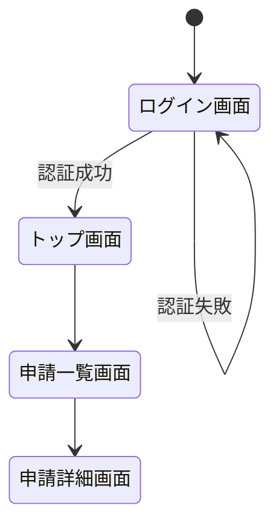

# 基本設計 成果物 ツール・データ形式 選定ガイド

> **このファイルの目的**: 基本設計フェーズで作成する各成果物（B-01〜B-19）について、ツールとデータ形式の選択肢を整理します。
> **凡例**: ◎ ベストな選択 ／ ○ 有力な選択肢 ／ △ 使えるが非推奨

---

## B-01. システム構成図（論理・物理）

| 観点 | ツール | データ形式 |
|-----|-------|----------|
| 世界標準 | Draw.io (diagrams.net)、Lucidchart、Miro、PlantUML、AWS Architecture Icons | PNG、SVG、XML |
| 日本の現場 | Microsoft Visio、Excel（罫線）、Cacoo、PowerPoint | VSDX、XLSX、PPTX |
| ◎ ベスト | **Draw.io (diagrams.net)** | **XML（ソース管理）＋PNG/SVG（共有用）** |

**ベストを選ぶ理由**
- 無料で使えるブラウザ／デスクトップアプリ
- AWS・Azure・GCPのアイコンが内蔵されており、クラウド構成図を素早く描ける
- ファイル形式がXMLのため、Gitでバージョン管理ができる
- Confluence・Notionへの埋め込みにも対応

**使い方のヒント**
> Draw.ioのファイルは `.drawio` または `.xml` として保存し、Gitリポジトリに含めましょう。変更履歴が追跡できます。PNG/SVGは設計書への貼り付け用に別途エクスポートします。

---

## B-02. 技術スタック選定書

| 観点 | ツール | データ形式 |
|-----|-------|----------|
| 世界標準 | Confluence、Notion、GitHub Wiki、ADR（Architecture Decision Records） | Markdown |
| 日本の現場 | Excel、Word、PowerPoint | XLSX、DOCX、PPTX |
| ◎ ベスト | **Notion または Confluence** | **Markdown** |

**ベストを選ぶ理由**
- 世界標準の記法であるADR（Architecture Decision Records）を使うと、「なぜその技術を選んだか」の意思決定履歴が残せる
- Markdownはプレーンテキストのためバージョン管理が容易

---

### ADRとは何か

ADR（Architecture Decision Records）は、**アーキテクチャ上の重要な意思決定を1件1ファイルで記録する手法**です。「何を決めたか」だけでなく「なぜそれを選んだか・何を却下したか」を残すことで、半年後・1年後に「なぜこうなっているの？」という疑問に答えられるようになります。

---

### ベストなADR管理方法

#### 1. ファイル配置

Gitリポジトリの中に `docs/adr/` ディレクトリを作り、1決定 = 1ファイルで管理します。

```
プロジェクトルート/
└── docs/
    └── adr/
        ├── ADR-001-backend-framework.md
        ├── ADR-002-database-selection.md
        ├── ADR-003-authentication-method.md
        └── README.md   ← ADR一覧インデックス
```

#### 2. 命名規則

```
ADR-[3桁連番]-[内容を端的に表す英語].md
例: ADR-001-backend-framework.md
```

#### 3. ステータスの種類

ADRには必ずステータスを付けます。後から意思決定が変わった場合も、削除せずステータスを更新することが重要です。

| ステータス | 意味 |
|---------|-----|
| 提案中（Proposed） | 議論中。まだ確定していない |
| 採用（Accepted） | 確定した決定 |
| 却下（Rejected） | 検討したが採用しなかった |
| 廃止（Deprecated） | 以前は採用していたが、現在は使っていない |
| 置換（Superseded by ADR-XXX） | 別のADRに更新された。参照先を明記する |

#### 4. ADRフォーマット（MADR形式 ― 最も普及している書き方）

```markdown
# ADR-001: バックエンドフレームワークにSpring Bootを採用する

## ステータス
採用（2024-11-01）

## 背景・課題
チームの主力スキルがJavaであり、既存社内ライブラリもJavaベース。
新規フレームワーク習得コストを最小化する必要がある。

## 決定事項
Spring Boot 3.x を採用する。

## 検討した選択肢

| 選択肢 | メリット | デメリット | 評価 |
|-------|--------|---------|-----|
| Spring Boot 3.x | チームに知見あり、社内実績多数 | JVMのオーバーヘッド | ◎ 採用 |
| FastAPI（Python） | 軽量・高速 | チームにPython経験者なし | × 却下 |
| NestJS（Node.js） | モダン・型安全 | 社内実績なし、学習コスト大 | × 却下 |

## 影響・トレードオフ
- デプロイにJVMランタイムが必要。Dockerイメージがやや大きくなる（約200MB増）
- 社内のJavaライブラリをそのまま流用できる

## 関連するADR
- ADR-003（認証方式）はSpring Securityの採用を前提としている
```

#### 5. ADR一覧インデックス（README.md）

`docs/adr/README.md` にADRの一覧表を維持します。**手動更新は更新忘れが起きやすいため、スクリプトで自動生成する運用を推奨します**（後述「自動生成の方法」を参照）。

手動で作成する場合のフォーマットは以下のとおりです。

```markdown
# アーキテクチャ決定記録（ADR）一覧

| No. | タイトル | ステータス | 決定日 |
|----|--------|---------|------|
| [ADR-001](ADR-001-backend-framework.md) | バックエンドフレームワークにSpring Bootを採用 | 採用 | 2024-11-01 |
| [ADR-002](ADR-002-database-selection.md) | データベースにPostgreSQLを採用 | 採用 | 2024-11-05 |
| [ADR-003](ADR-003-authentication-method.md) | 認証方式にJWT + Spring Securityを採用 | 採用 | 2024-11-10 |
```

---

#### 5-1. README.md の自動生成方法

`docs/adr/` 内のADRファイルを読み取り、README.mdを自動生成・更新するスクリプトを用意しています。
**前提となるADRファイルの書き方（第1行・ステータス行のフォーマットを合わせる必要があります）：**

```markdown
# ADR-001: （タイトルをここに書く）

## ステータス
採用（2024-11-01）     ← "ステータス名（YYYY-MM-DD）" の形式で書く
```

---

**方法A：PowerShellスクリプト＋batファイル（Windowsで最も簡単）**

`docs/adr/` フォルダに以下の2ファイルを配置します。

**① `generate-adr-index.ps1`（スクリプト本体）**

```powershell
# generate-adr-index.ps1
# docs/adr/ フォルダにあるADRファイルを読み取り、README.md を自動生成する

$adrDir  = Split-Path -Parent $MyInvocation.MyCommand.Path
$outFile = Join-Path $adrDir "README.md"

$lines = @()
$lines += "# アーキテクチャ決定記録（ADR）一覧"
$lines += ""
$lines += "> このファイルは generate-adr-index.bat を実行すると自動更新されます。直接編集しないでください。"
$lines += ""
$lines += "| No. | タイトル | ステータス | 決定日 |"
$lines += "|----|--------|---------|------|"

Get-ChildItem -Path $adrDir -Filter "ADR-*.md" | Sort-Object Name | ForEach-Object {
    $file    = $_
    $content = Get-Content $file.FullName -Encoding UTF8

    # 1行目から「# ADR-NNN: タイトル」を取得
    $titleLine = $content | Where-Object { $_ -match "^# ADR-\d+" } | Select-Object -First 1
    $title     = ($titleLine -replace "^# ADR-\d+[:\s]+", "").Trim()
    $no        = ($file.BaseName -replace "^(ADR-\d+).*", '$1')

    # "## ステータス" の次の行を取得
    $statusIdx = -1
    for ($i = 0; $i -lt $content.Count; $i++) {
        if ($content[$i] -match "^## ステータス") { $statusIdx = $i + 1; break }
    }
    $statusRaw = if ($statusIdx -ge 0) { $content[$statusIdx].Trim() } else { "-" }

    # ステータス名と日付を分離（例: "採用（2024-11-01）"）
    $date       = if ($statusRaw -match "（(\d{4}-\d{2}-\d{2})）") { $Matches[1] } else { "-" }
    $statusText = ($statusRaw -replace "（\d{4}-\d{2}-\d{2}）", "").Trim()

    $lines += "| [$no]($($file.Name)) | $title | $statusText | $date |"
}

$lines | Set-Content -Path $outFile -Encoding UTF8
Write-Host "✔ README.md を更新しました: $outFile"
```

**② `generate-adr-index.bat`（ダブルクリックで実行するランチャー）**

```bat
@echo off
chcp 65001 > nul
powershell -ExecutionPolicy Bypass -File "%~dp0generate-adr-index.ps1"
echo.
pause
```

**実行方法**

```
generate-adr-index.bat をダブルクリックするだけ
→ docs/adr/README.md が自動生成（上書き更新）される
```

---

**方法B：GitHub Actions（Gitへのプッシュ時に自動実行）**

GitHubを使っている場合、ADRファイルを追加・更新してプッシュすると自動的にREADME.mdを更新できます。

プロジェクトルートに `.github/workflows/update-adr-index.yml` を作成します。

```yaml
name: ADRインデックス自動更新

on:
  push:
    paths:
      - 'docs/adr/ADR-*.md'   # ADRファイルが変更されたときだけ動く

jobs:
  update-index:
    runs-on: ubuntu-latest
    steps:
      - uses: actions/checkout@v4

      - name: README.md を生成
        run: |
          DIR="docs/adr"
          OUT="$DIR/README.md"
          {
            echo "# アーキテクチャ決定記録（ADR）一覧"
            echo ""
            echo "> このファイルは自動生成されます。直接編集しないでください。"
            echo ""
            echo "| No. | タイトル | ステータス | 決定日 |"
            echo "|----|--------|---------|------|"
            for f in $(ls $DIR/ADR-*.md 2>/dev/null | sort); do
              fname=$(basename "$f")
              no=$(echo "$fname" | sed 's/^\(ADR-[0-9]*\).*/\1/')
              title=$(grep "^# ADR-" "$f" | head -1 | sed 's/^# ADR-[0-9]*[: ]*//')
              status_raw=$(awk '/^## ステータス/{getline; print; exit}' "$f")
              date=$(echo "$status_raw" | grep -oP '\d{4}-\d{2}-\d{2}' || echo "-")
              status=$(echo "$status_raw" | sed 's/（[0-9-]*）//' | xargs)
              echo "| [$no]($fname) | $title | $status | $date |"
            done
          } > "$OUT"

      - name: README.md をコミット
        run: |
          git config user.name  "github-actions[bot]"
          git config user.email "github-actions[bot]@users.noreply.github.com"
          git add docs/adr/README.md
          git diff --cached --quiet || git commit -m "docs: ADRインデックスを自動更新"
          git push
```

**動作の流れ**

```
① チームメンバーが ADR-004-xxx.md を作成してGitHubにプッシュ
         ↓
② GitHub Actions が自動起動
         ↓
③ README.md を再生成してリポジトリに自動コミット
         ↓
④ 常に最新のインデックスが維持される（手動作業ゼロ）
```

---

**どちらを選ぶか**

| 方法 | 向いている状況 |
|-----|-------------|
| **方法A（batファイル）** | GitHub を使っていない・CI環境がない・手軽に始めたい |
| **方法B（GitHub Actions）** | GitHub でソース管理している・完全自動化したい |

> **まず方法Aから始めることを推奨します。** batファイルは環境構築不要でダブルクリックするだけです。GitHub Actionsは後から追加できます。

#### 6. レビューの進め方

ADRはGitのプルリクエスト（PR）を使ってレビューします。

```
① SE がADRのMarkdownファイルを作成し、featureブランチにコミット
② GitHubでPRを作成し、チームメンバー・アーキテクトにレビュー依頼
③ レビューコメントでの議論・修正
④ 合意が取れたらマージ → ステータスを「採用」に変更
```

このフローにより、**意思決定の議論がGit履歴として永久に残ります**。

#### 7. 補助ツール（任意）

| ツール | 用途 |
|------|-----|
| **Log4brains** | ADRをブラウザで見やすく表示するビューア（無料・OSSツール） |
| **adr-tools** | コマンド1つでADRファイルの雛形を生成するCLIツール |
| **GitHub Actions** | PRマージ時にADR一覧を自動更新するCI連携 |

> **シンプルに始めるなら**: Log4brainsやadr-toolsは後から導入できます。まずは `docs/adr/` ディレクトリを作り、上記フォーマットでMarkdownファイルを書くだけで十分です。

---

## B-03. 機能一覧（設計版）

| 観点 | ツール | データ形式 |
|-----|-------|----------|
| 世界標準 | Confluence、Notion、Jira（エピック・ストーリー管理） | Markdown、CSV |
| 日本の現場 | Excel | XLSX |
| ◎ ベスト | **Excel または Notion** | **XLSX（Excel）／ CSV（機械処理用）** |

**ベストを選ぶ理由**
- 機能一覧は表形式が最も見やすく、ExcelかNotionのデータベース機能が適している
- Excelはフィルタ・ソートが使いやすく、顧客への提出にも適している
- Notionは複数人での同時編集・ステータス管理が得意

**推奨カラム構成**

| 機能ID | 機能名 | 概要 | UI種別 | 優先度 | 担当者 | ステータス |
|-------|-------|-----|-------|------|-------|---------|
| F-001 | 経費申請 | 経費を申請する | 画面 | 必須 | 〇〇 | 設計中 |

> UI種別は「画面 / バッチ / 帳票 / API」で明示し、漏れを防ぎます。

---

## B-04. 画面一覧

| 観点 | ツール | データ形式 |
|-----|-------|----------|
| 世界標準 | Confluence、Notion、Figma（サイトマップ機能） | Markdown、CSV |
| 日本の現場 | Excel | XLSX |
| ◎ ベスト | **Excel** | **XLSX** |

**ベストを選ぶ理由**
- 画面一覧はシンプルな表管理で十分。Excel が最も汎用性が高い
- 後工程の画面レイアウト定義書（B-05）と同じファイルのシートとして管理すると一元化できる

**推奨カラム構成**

| 画面ID | 画面名 | 対応機能ID | 遷移元 | 遷移先 | 備考 |
|-------|-------|----------|------|------|-----|
| SCR-001 | ログイン画面 | F-001 | （なし） | SCR-002 | 未ログイン時のデフォルト |

---

## B-05. 画面レイアウト定義書（ワイヤーフレーム）

| 観点 | ツール | データ形式 |
|-----|-------|----------|
| 世界標準 | **Figma**、Sketch、Adobe XD、Balsamiq、Miro | Figmaリンク、PNG、SVG |
| 日本の現場 | Excel（罫線でレイアウト）、PowerPoint、Figma（近年急増中） | XLSX、PPTX |
| ◎ ベスト | **Figma** | **Figmaリンク（共有URL）＋PNG（設計書貼り付け用）** |

**ベストを選ぶ理由**
- チームでのリアルタイム共同編集が可能
- コメント機能でレビューのやり取りができる
- 「Inspect」機能でエンジニアがCSSやサイズを直接参照でき、詳細設計以降の工数が削減できる
- 無料プランでも基本設計レベルには十分対応できる

**Excelワイヤーフレームを使う場合の注意点**
> ExcelはレイアウトをPNGにエクスポートできないため、スクリーンショットを設計書に貼る運用になりがちです。修正のたびに貼り直しが発生するため、工数がかかります。

---

## B-06. 画面遷移図（設計版）

| 観点 | ツール | データ形式 |
|-----|-------|----------|
| 世界標準 | Figma（プロトタイプ機能）、Draw.io、Mermaid（stateDiagram） | Figmaリンク、PNG、SVG |
| 日本の現場 | Excel、PowerPoint、Cacoo | XLSX、PPTX |
| ◎ ベスト | **Figma（ワイヤーフレームと統合）または Draw.io** | **Figmaリンク or PNG** |

**ベストを選ぶ理由**
- Figmaでワイヤーフレームとプロトタイプをセットで管理すると、画面と遷移が常に一致した状態を保てる
- 単独で遷移図だけ作る場合はDraw.ioが軽量で使いやすい

**Mermaid記法の例（テキストで管理したい場合）**


---

## B-07. API一覧 / API仕様書（概要版）

| 観点 | ツール | データ形式 |
|-----|-------|----------|
| 世界標準 | **OpenAPI（Swagger）**、Postman、Stoplight Studio、Redocly | YAML、JSON |
| 日本の現場 | Excel、Word（近年はSwagger・OpenAPIへ移行中） | XLSX、DOCX |
| ◎ ベスト | **OpenAPI（YAML形式）＋ Stoplight Studio または Swagger UI** | **YAML** |

**ベストを選ぶ理由**
- OpenAPI仕様書はYAMLで書くと人間にも読みやすく、Gitでバージョン管理できる
- Swagger UIやStoplight Studioで自動的にHTML形式のドキュメントに変換できる
- Postman・クライアントコードの自動生成ツールとの連携が可能

**基本設計フェーズでのOpenAPIの使い方**
> 基本設計では詳細なリクエスト/レスポンス定義まで不要です。エンドポイント・HTTPメソッド・概要・主要パラメータを記載した「概要版」として作成し、詳細設計フェーズで肉付けするアプローチが効率的です。

**OpenAPI最小構成の例**
```yaml
openapi: 3.0.3
info:
  title: 経費精算API
  version: 1.0.0
paths:
  /expenses:
    get:
      summary: 経費申請一覧取得
      description: ログインユーザーの経費申請一覧を返す
      responses:
        '200':
          description: 成功
    post:
      summary: 経費申請作成
      description: 新規経費申請を作成する
      responses:
        '201':
          description: 作成成功
```

---

### OpenAPI（YAML）を非エンジニア向けの資料に変換する方法

YAMLファイルそのままでは非エンジニアには読みにくいため、用途に応じて以下の形式に変換します。

---

#### 方法① Redoc → HTML／PDF（最も手軽・環境構築不要）

**Redoc** は OpenAPI の YAML ファイルを、見やすいWebページに自動変換するツールです。HTMLファイルを1つ作るだけで完結します。

**手順**

```
① 以下の内容で index.html を作成し、api-spec.yaml と同じフォルダに置く
② index.html をブラウザで開く → API仕様書が表示される
③ ブラウザの印刷機能（Ctrl+P）→「PDFに保存」で PDF として出力できる
```

**index.html の内容**
```html
<!DOCTYPE html>
<html>
<head>
  <title>API仕様書</title>
  <meta charset="utf-8"/>
</head>
<body>
  <redoc spec-url='api-spec.yaml'></redoc>
  <script src="https://cdn.redoc.ly/redoc/latest/bundles/redoc.standalone.js"></script>
</body>
</html>
```

> **これが最もシンプルな方法です。** ファイル2つ（index.html と api-spec.yaml）を同じフォルダに置いてブラウザで開くだけです。ただしインターネット接続が必要です（スクリプトをオンラインから読み込むため）。

**Redocが生成するページの構成**
```
左ペイン: APIの目次（エンドポイント一覧）
右ペイン: 各APIの詳細
  ・API名・説明文
  ・HTTPメソッドとURL（例: GET /expenses）
  ・リクエストパラメータの説明
  ・レスポンスの説明とサンプル
```

---

#### 方法② Stoplight Studio（GUIツール ― 非エンジニアも操作できる）

**Stoplight Studio** は OpenAPI の YAML をグラフィカルな画面で閲覧・編集できる無料ツールです。YAMLを直接見せるより格段に分かりやすくなります。

```
① Stoplight Studio をインストール（無料・Windows/Mac対応）
② api-spec.yaml ファイルを Stoplight Studio で開く
③ 「Preview」タブで非エンジニア向けの閲覧ビューが表示される
④ 顧客と画面を共有しながらレビューする
```

> 非エンジニアの顧客にAPIの概要をレビューしてもらう際に、Stoplight のプレビュー画面を一緒に見ながら説明するのが効果的です。

---

#### 方法③ Excel変換（PowerShellスクリプト ― 「Excelで渡してほしい」場合）

HTMLやPDFではなく「Excelで渡したい」場合は、以下のPowerShellスクリプトでAPI一覧をCSV（Excelで開ける形式）に変換できます。

**前提**: Windows PowerShell 5.1以上（Windows標準。インストール不要）

**`openapi-to-csv.ps1`**
```powershell
# openapi-to-csv.ps1
# OpenAPI の YAML ファイルを読み取り、API一覧を CSV に変換する
# 出力した CSV は Excel で開いて使用する

param(
    [string]$YamlFile = "api-spec.yaml",
    [string]$OutFile  = "api-list.csv"
)

$content = Get-Content $YamlFile -Encoding UTF8
$rows    = @()
$rows   += '"No.","HTTPメソッド","エンドポイント","概要","説明"'
$no      = 1
$path    = ""
$method  = ""
$summary = ""
$desc    = ""

foreach ($line in $content) {
    if ($line -match "^  (/\S+):") {
        $path = $Matches[1]
    }
    elseif ($line -match "^    (get|post|put|patch|delete):") {
        # 前のメソッドにdescriptionがなかった場合の出力
        if ($method -ne "" -and $summary -ne "") {
            $rows += """$no"",""$method"",""$path"",""$summary"",""$desc"""
            $no++
        }
        $method  = $Matches[1].ToUpper()
        $summary = ""
        $desc    = ""
    }
    elseif ($line -match "^\s+summary:\s+(.+)") {
        $summary = $Matches[1].Trim()
    }
    elseif ($line -match "^\s+description:\s+(.+)") {
        $desc = $Matches[1].Trim()
        if ($method -ne "" -and $summary -ne "") {
            $rows += """$no"",""$method"",""$path"",""$summary"",""$desc"""
            $no++
            $method = ""
        }
    }
}
# 末尾のAPIが description なしで終わっている場合の出力
if ($method -ne "" -and $summary -ne "") {
    $rows += """$no"",""$method"",""$path"",""$summary"",""$desc"""
}

$rows | Set-Content -Path $OutFile -Encoding UTF8
Write-Host "✔ $OutFile を出力しました"
Write-Host "  Excelで開く: ファイルを右クリック → プログラムから開く → Excel"
```

**実行方法**
```
powershell -ExecutionPolicy Bypass -File openapi-to-csv.ps1
```

**出力されるCSVをExcelで開いた場合のイメージ**

| No. | HTTPメソッド | エンドポイント | 概要 | 説明 |
|----|------------|------------|-----|-----|
| 1 | GET | /expenses | 経費申請一覧取得 | ログインユーザーの経費申請一覧を返す |
| 2 | POST | /expenses | 経費申請作成 | 新規経費申請を作成する |

> **CSVをExcelで開く方法**: CSVファイルを右クリック→「プログラムから開く」→「Excel」を選択。文字化けする場合は、Excelを起動して「データ」タブ→「テキスト/CSVから」→文字コード「UTF-8」を選択してインポートしてください。

---

#### 方法の選び方まとめ

| 目的 | 推奨する方法 | 手間 |
|-----|-----------|-----|
| 顧客へのレビュー用資料（きれいに見せたい） | 方法① Redoc → PDF | ★☆☆ |
| 顧客と画面を見ながら口頭説明する | 方法② Stoplight Studio | ★☆☆ |
| 「Excelで一覧を渡してほしい」と言われた | 方法③ PowerShellスクリプト | ★★☆ |
| エンジニア向け共有（変換不要） | YAML のまま Swagger UI で表示 | ★☆☆ |

> **まずは方法①（Redoc）から試してください。** HTMLファイルを1つ作るだけで、ブラウザで見やすいAPI仕様書が完成します。顧客へのレビューであれば PDF に印刷して渡すだけで十分なケースがほとんどです。

---

## B-08. バッチ一覧

| 観点 | ツール | データ形式 |
|-----|-------|----------|
| 世界標準 | Confluence、Notion | Markdown、CSV |
| 日本の現場 | Excel | XLSX |
| ◎ ベスト | **Excel** | **XLSX** |

**ベストを選ぶ理由**
- バッチ一覧は機能一覧と同様のシンプルな表管理で十分
- 機能一覧（B-03）のUI種別「バッチ」で管理する方法もあり、別ファイルにする必要がない場合も多い

**推奨カラム構成**

| バッチID | バッチ名 | 概要 | 起動方式 | 実行頻度・時刻 | 処理対象件数目安 | 異常時対応 |
|--------|--------|-----|--------|------------|-------------|---------|
| BAT-001 | 月次集計バッチ | 経費データを月次集計する | スケジューラ | 毎月1日 1:00 | 〜5,000件 | アラート通知 |

---

## B-09. ER図（概念・論理）

| 観点 | ツール | データ形式 |
|-----|-------|----------|
| 世界標準 | **dbdiagram.io**、Mermaid（erDiagram）、Draw.io、Lucidchart、DataGrip | DBML、PNG、SVG |
| 日本の現場 | A5:SQL Mk-2、SI Object Browser、MySQL Workbench、Excel（手書き） | PNG、XLSX |
| ◎ ベスト | **dbdiagram.io（概念・論理）** または **A5:SQL Mk-2（DB接続して逆生成する場合）** | **DBML（ソース管理）＋PNG（設計書用）** |

**ベストを選ぶ理由（dbdiagram.io）**
- ブラウザで動くため環境構築不要
- DBMLというシンプルなテキスト形式で記述するため、Gitで変更管理できる
- PNG/PDFへのエクスポートが容易

**DBMLの記述例**
```dbml
Table users {
  id integer [pk, increment, note: "ユーザーID"]
  email varchar [unique, not null]
  name varchar [not null]
  created_at timestamp [default: `now()`]
}

Table expenses {
  id integer [pk, increment]
  user_id integer [ref: > users.id, note: "申請者"]
  amount integer [not null, note: "金額（円）"]
  status varchar [note: "draft/submitted/approved/rejected"]
  created_at timestamp
}
```

**A5:SQL Mk-2 を選ぶ場合**
> 開発中にDBへ接続して現状のテーブルからER図を自動生成（逆生成）できます。日本語対応が充実しており、テーブル定義書のExcel出力機能もあります。

---

## B-10. テーブル定義書

| 観点 | ツール | データ形式 |
|-----|-------|----------|
| 世界標準 | dbdocs.io（DBMLから自動生成）、Liquibase・Flyway（マイグレーションスクリプト）、DataGrip | SQL（DDL）、YAML |
| 日本の現場 | Excel（所定フォーマット）、A5:SQL Mk-2（Excel出力） | XLSX |
| ◎ ベスト | **Excel（顧客提出用）＋ SQL DDL（開発用・正本）** | **XLSX ＋ SQL** |

---

### SQL DDLとは何か

**DDL（Data Definition Language）** とは、データベースの「構造」を定義するためのSQL文のことです。「データ定義言語」とも呼びます。

「テーブルを作る・変更する・削除する」ための命令文であり、実際にデータベースへ実行することでテーブルが生成されます。

**代表的なDDL文**

| DDL文 | 意味 |
|------|-----|
| `CREATE TABLE` | テーブルを新規作成する |
| `ALTER TABLE` | 既存テーブルの構造を変更する（カラム追加など） |
| `DROP TABLE` | テーブルを削除する |
| `CREATE INDEX` | 検索高速化のためのインデックスを作成する |

**`CREATE TABLE` の例**

```sql
CREATE TABLE users (
    id          INTEGER      NOT NULL AUTO_INCREMENT COMMENT 'ユーザーID',
    email       VARCHAR(255) NOT NULL                COMMENT 'メールアドレス（ログインID）',
    name        VARCHAR(100) NOT NULL                COMMENT '氏名',
    created_at  TIMESTAMP    NOT NULL DEFAULT NOW()  COMMENT '作成日時',
    PRIMARY KEY (id),
    UNIQUE INDEX uq_users_email (email)
);
```

この文をMySQLやPostgreSQLに実行すると、`users` テーブルが実際に作られます。

---

### SQL DDLはExcelに出力できるのか？

**DDLファイル自体を直接Excelに変換する機能はありません。** ただし、以下の方法でテーブル定義書（Excel）を得ることができます。

#### 方法①：A5:SQL Mk-2（最も簡単・日本製の無料ツール）

A5:SQL Mk-2には **「ER図エディタ」** という機能があり、**実際のDBに接続しなくても** テーブルを設計してExcelのテーブル定義書を出力できます。基本設計フェーズではこちらの使い方が主体になります。

---

**［DB接続なし］ER図エディタでテーブルを設計してExcel出力する手順**

```
STEP 1. A5:SQL Mk-2 を起動する
         ↓
STEP 2. メニュー「ファイル」→「新規作成」→「ER図」を選択
        → .a5er という拡張子のER図ファイルが作成される
         ↓
STEP 3. ER図エディタ上で右クリック →「エンティティの追加」
        → テーブルのボックスが配置される
         ↓
STEP 4. ボックスをダブルクリック → テーブル定義ダイアログが開く
        以下を入力する：
        ・テーブル名（物理名）例: users
        ・テーブルの説明（論理名）例: ユーザー
        ・カラムごとに：カラム名／データ型／桁数／NOT NULL／PK／コメント
         ↓
STEP 5. 他のテーブルも同様に追加し、外部キーの関連線を引く
        （エンティティの端点をドラッグして別エンティティに繋げる）
         ↓
STEP 6. メニュー「ER図」→「テーブル定義書の作成」を選択
        → 保存先を指定するとExcelファイルが自動生成される
```

> **メニューの表記はバージョンによって若干異なる場合があります。**「テーブル定義書」という文字列をメニューから探してください。

---

**ER図からDDL（CREATE TABLE文）を出力する手順**

Excelだけでなく、ER図からSQL DDLも出力できます。

```
メニュー「ER図」→「DDLの作成」→ 対象DBの種類を選択（MySQL / PostgreSQL など）
→ CREATE TABLE文が生成される → ファイルに保存またはクリップボードにコピー
```

この機能を使うと、**ER図 → Excel定義書（説明用）とSQL DDL（開発用）の両方を同じソースから生成**できます。二重管理の問題を最小化できる運用です。

---

**A5:SQL Mk-2のER図を使った推奨ワークフロー（DB接続なし）**

```
① A5:SQL Mk-2でER図（.a5er）を作成・テーブル定義を入力
          ↓
② 「テーブル定義書の作成」→ Excel出力 → 顧客・関係者レビュー・承認
          ↓
③ 「DDLの作成」→ SQL（CREATE TABLE文）出力 → Gitリポジトリに保存
          ↓
④ 修正が必要になったら .a5er ファイルを編集 → ②③を再実行
```

> **.a5er ファイルもGitで管理しましょう。** ER図の変更履歴が追跡でき、チームで共有できます。

---

**DB接続ありの場合（参考）**

既存のDBが存在する場合は、DBに接続してテーブル構造を逆生成（リバースエンジニアリング）することもできます。

```
① A5:SQL Mk-2 でDBに接続（DB接続の設定を追加）
② 接続後、対象DBを右クリック →「ER図の作成（リバースエンジニアリング）」
③ 既存テーブルからER図が自動生成される
④ 以降は上記の②③と同様にExcel・DDLを出力
```

---

### テーブルに変更があった場合のALTER文生成

テーブル定義を変更したとき、`CREATE TABLE` を再生成しても既存DBには適用できません。既存DBへの変更には `ALTER TABLE` 文が必要です。A5:SQL Mk-2 での対応方法を以下に整理します。

---

#### 結論から言うと

| 状況 | ALTER文の自動生成 |
|-----|----------------|
| ER図とDB接続が両方ある | **可能**（差分DDL生成機能を使う） |
| ER図のみ（DB接続なし） | **直接は不可**。代替手段あり（後述） |

---

#### 方法A：DB接続ありの場合 ― 差分DDL生成（推奨）

A5:SQL Mk-2 には「ER図と実際のDBを比較して、差分のALTER文を自動生成する」機能があります。

**手順**
```
① A5:SQL Mk-2 でDBに接続する

② ER図（.a5er）を変更・保存する
   例：usersテーブルにphone_numberカラムを追加

③ メニュー「ER図」→「データベースへの適用（差分DDLの生成）」を選択
   ※ メニュー名はバージョンにより「スキーマ比較」「DDL差分」などと表記される場合あり

④ 比較画面が開き、ER図とDBの差分が一覧表示される
   例：
   [追加] users.phone_number VARCHAR(20)
   [変更] expenses.amount の型が INTEGER → BIGINT

⑤ 適用したい差分を選択して「DDL生成」→ ALTER文が出力される
   例：
   ALTER TABLE users ADD COLUMN phone_number VARCHAR(20);
   ALTER TABLE expenses MODIFY COLUMN amount BIGINT NOT NULL;

⑥ 生成されたALTER文を確認し、DBに実行する
```

> **この機能が最も確実です。** ER図の変更内容をA5:SQL Mk-2が自動で読み取り、必要なALTER文だけを生成してくれるため、変更の書き漏らしを防げます。

---

#### 方法B：DB接続なしの場合 ― 手動でALTER文を作成する

DB接続がない設計フェーズでは、自動生成は使えません。以下の手順でALTER文を手動で用意します。

**手順**
```
① ER図（.a5er）を変更する
   例：usersテーブルにphone_numberカラムを追加

② Gitで変更前後の差分を確認する（どこを変えたか把握する）
   git diff docs/adr/ や git log で変更内容を確認

③ 変更内容をもとに ALTER文を手書きする
   例：
   -- usersテーブルにphone_numberを追加（2024-12-01 追加）
   ALTER TABLE users ADD COLUMN phone_number VARCHAR(20) COMMENT '電話番号';

④ ALTER文を migration/ フォルダなどに連番ファイルで保存する
   例：migration/V002__add_phone_number_to_users.sql

⑤ ER図から CREATE TABLE（全量）も再生成し、Gitにコミットする
   → ALTER文と CREATE TABLE の両方を最新の状態でGit管理する
```

**migrationフォルダの構成例**
```
migration/
├── V001__create_initial_tables.sql   ← 最初のCREATE TABLE一式
├── V002__add_phone_number_to_users.sql
├── V003__change_amount_to_bigint.sql
└── V004__add_approval_table.sql
```

> ファイル名の `V001__` のような連番プレフィックスは、後述のFlyway形式に合わせておくと、将来的に自動適用ツールへ移行しやすくなります。

---

#### 方法C：Flyway を使った本格的なマイグレーション管理（開発フェーズ向け）

開発が本格化したら、**Flyway** というツールを使うとALTER文の管理・DB適用を自動化できます。

**Flywayとは**
> SQLのマイグレーションファイル（V001__〜.sql）を連番で管理し、まだDBに適用されていないファイルだけを自動で実行してくれるツール。「どのALTER文をDBに適用済みか」を自動追跡するため、手動管理のミスがなくなります。

**基本的な使い方**
```
① migration/ フォルダに V002__add_phone_number.sql を追加
② flyway migrate コマンドを実行
③ Flyway が未適用のファイルを検出し、DBに自動実行する
④ 適用済みの履歴はDB内の flyway_schema_history テーブルに記録される
```

> **設計フェーズでは不要ですが、開発開始時に導入を検討してください。** 方法Bの連番ファイル形式で書いておけば、そのままFlywayに移行できます。

---

#### まとめ：フェーズ別の推奨手順

| フェーズ | 推奨方法 |
|--------|--------|
| **基本設計フェーズ**（DBなし） | 方法B：ALTER文を手書きし、連番ファイルで保存 |
| **開発フェーズ初期**（DB構築済み） | 方法A：A5:SQL Mk-2の差分DDL生成を活用 |
| **開発フェーズ本格化** | 方法C：Flywayで自動管理 |

#### 方法②：dbdocs.io（DDLまたはDBMLからWebドキュメントを生成）

DDLファイルをDBMLに変換し、dbdocs.ioにアップロードするとブラウザで閲覧できるテーブル定義ドキュメントになります（Excel出力は非対応ですが、HTML形式で共有できます）。

#### 方法③：Excel手動作成（最も多い現場の実態）

DDLを見ながらExcelのテーブル定義書を手動で埋める方法です。最も確実ですが、**DDLとExcelの二重管理になり、どちらかが古くなるリスク**があります。

---

### 推奨する運用フロー

```
【設計フェーズ】
  ↓ テーブル定義を検討
  ↓ A5:SQL Mk-2 または dbdiagram.io でER図・テーブル定義を作成
  ↓ Excelに出力 → 顧客・関係者レビュー・承認

【開発フェーズ】
  ↓ 承認済みのテーブル定義をもとに SQL DDL（CREATE TABLE文）をコーディング
  ↓ SQL DDL を Git で管理（これが「正本」）
  ↓ Flyway / Liquibase などのツールでDDLをDBに自動適用

【変更が発生した場合】
  ↓ SQL DDL を修正 → Git にコミット → レビュー → 適用
  ↓ Excelも合わせて更新（または A5:SQL Mk-2 で再出力）
```

> **よくある失敗**: Excelを正本にして管理していると、開発が進むにつれてDB実態とExcelがズレていきます。「どちらが正しいのか分からない」という状況を防ぐために、開発が始まったら **SQL DDLをGitで管理することを正本** とする運用に切り替えることを強くお勧めします。

---

**ベストを選ぶ理由**
- テーブル定義書はExcelが日本の現場では最も互換性が高く、顧客・関係者への説明がしやすい
- ただし「ExcelがDB構造の正本」になると、実装とズレが生じやすい
- SQL DDL（`CREATE TABLE`文）を正本とし、Excelは説明用に自動生成する運用がベスト

**推奨カラム構成（Excelシート）**

| カラム名 | 論理名 | データ型 | 桁数 | NULL | PK | FK | デフォルト | 説明 |
|--------|------|--------|-----|------|----|----|---------|-----|
| id | ユーザーID | INTEGER | - | NOT NULL | ✓ | - | AUTO | サロゲートキー |
| email | メールアドレス | VARCHAR | 255 | NOT NULL | - | - | - | ログインID |

---

## B-11. マスタデータ定義書

| 観点 | ツール | データ形式 |
|-----|-------|----------|
| 世界標準 | Confluence、Notion | Markdown、CSV |
| 日本の現場 | Excel | XLSX |
| ◎ ベスト | **Excel** | **XLSX（定義書）＋ CSV（実データ投入用）** |

**ベストを選ぶ理由**
- マスタデータは一覧表管理が最も分かりやすい
- 実際のデータ投入（初期データ）はCSV形式でSQLのINSERT文やシードスクリプトに使いまわせる

**推奨シート構成（Excel）**
- シート1: コード種別一覧（コード区分・説明・管理担当）
- シート2〜: 各コードの値一覧（コード値・表示名・並び順・有効フラグ）

---

## B-12. 外部インタフェース設計書

| 観点 | ツール | データ形式 |
|-----|-------|----------|
| 世界標準 | OpenAPI（REST API連携）、AsyncAPI（非同期・メッセージング連携）、Confluence | YAML、JSON、Markdown |
| 日本の現場 | Excel、Word | XLSX、DOCX |
| ◎ ベスト | **REST API連携 → OpenAPI（YAML）** / **ファイル連携・その他 → Excel** | **YAML or XLSX（連携種別による）** |

**ベストを選ぶ理由**
- 連携方式によって最適なツールが異なる
- REST API / GraphQL の場合は OpenAPI が業界標準。連携先がドキュメントを使いまわせる
- CSVファイル転送・固定長ファイルなど汎用的な連携はExcelで項目定義を行うのが現実的

**設計書の推奨記載項目**
| 項目 | 内容 |
|-----|------|
| 連携ID | IF-001 |
| 連携先システム | 会計システム（SAP） |
| 連携方向 | 自→先（送信） |
| 連携方式 | SFTP ファイル転送 |
| 頻度・タイミング | 月次バッチ（毎月1日 2:00） |
| ファイル形式 | CSV、UTF-8、ヘッダ行あり |
| エラー時対応 | アラート通知、翌日再送 |
| 担当窓口 | 連携先システム担当: 〇〇部 △△さん |

---

## B-13. 非機能要件設計書

| 観点 | ツール | データ形式 |
|-----|-------|----------|
| 世界標準 | Confluence、Notion、GitHub Wiki | Markdown |
| 日本の現場 | Word、Excel | DOCX、XLSX |
| ◎ ベスト | **Confluence または Notion** | **Markdown** |

**ベストを選ぶ理由**
- 非機能要件設計書は文章と表が混在するドキュメント。Markdownベースのツールが更新しやすい
- Confluenceはページ間リンク・テーブル・コメントが使いやすく、レビューフローとの統合が容易
- チームにConfluenceがない場合はNotionが次善

**記載例（性能設計）**
| 測定指標 | 目標値 | 計測方法 |
|--------|------|--------|
| 画面表示レスポンスタイム | 95パーセンタイルで3秒以内 | 負荷テスト（k6） |
| API応答時間（参照系） | 平均1秒以内 | APMツール（Datadog） |
| 同時接続ユーザー数 | 50名 | 負荷テスト |

---

## B-14. セキュリティ設計書

| 観点 | ツール | データ形式 |
|-----|-------|----------|
| 世界標準 | Confluence、Notion、OWASP Threat Dragon（脅威モデリング）、draw.io（データフロー図） | Markdown、PNG |
| 日本の現場 | Word、Excel | DOCX、XLSX |
| ◎ ベスト | **Confluence または Notion（本文）＋ OWASP Threat Dragon（脅威モデリング）** | **Markdown ＋ PNG** |

**ベストを選ぶ理由**
- OWASP Threat Dragonは無料のオープンソースツールで、データフロー図（DFD）をもとに脅威を体系的に洗い出せる
- 脅威モデリングをスキップして設計書だけ作る場合でも、Confluenceで記述すると後からの更新・コメントがしやすい

**記載すべき主要セクション**
1. 認証・認可設計（認証フロー図、権限マトリクスへの参照）
2. 通信経路のセキュリティ（TLSバージョン、証明書管理）
3. データ保護（暗号化対象、個人情報の取り扱い）
4. 脅威と対策一覧（OWASP Top 10 対応状況）
5. 監査ログ設計
6. インシデント対応フロー

---

## B-15. 権限マトリクス

| 観点 | ツール | データ形式 |
|-----|-------|----------|
| 世界標準 | Confluence（テーブル）、Notion（データベース）、Spreadsheet | Markdown表、CSV |
| 日本の現場 | Excel | XLSX |
| ◎ ベスト | **Excel** | **XLSX** |

**ベストを選ぶ理由**
- 権限マトリクスは2次元の表（ロール × 機能）が最も視覚的に分かりやすい
- Excelのセル色付けと結合を使うと一目で把握できる

**記載例**

| 機能 | 一般社員（申請者） | 上長（承認者） | 経理担当 | システム管理者 |
|-----|--------------|------------|-------|------------|
| 経費申請（作成・編集） | ✓（自分のみ） | - | - | ✓ |
| 経費申請（承認・却下） | - | ✓（部下のみ） | - | ✓ |
| 月次集計レポート閲覧 | -（自分分のみ） | ✓（部下分） | ✓（全件） | ✓ |
| ユーザー管理 | - | - | - | ✓ |

---

## B-16. 運用設計書

| 観点 | ツール | データ形式 |
|-----|-------|----------|
| 世界標準 | Confluence、Notion、GitHub Wiki（Runbook） | Markdown |
| 日本の現場 | Word、Excel | DOCX、XLSX |
| ◎ ベスト | **Confluence または Notion** | **Markdown** |

**ベストを選ぶ理由**
- 運用設計書は現場の運用担当者が日々参照する生きたドキュメント。Wordより更新しやすいツールが望ましい
- Confluenceはページ構造・検索・バージョン履歴が充実しており、障害対応時に素早く参照できる
- 「Runbook」形式（手順書＋コマンド例をセットで記載）にすると、運用担当者の引き継ぎが容易になる

**記載すべき主要セクション**
1. 定常運用フロー（バックアップ確認、ジョブ監視）
2. 監視項目一覧（閾値・アラート通知先）
3. 障害対応フロー（フローチャート＋エスカレーション先）
4. リリース・デプロイ手順
5. ロールバック手順

---

## B-17. 移行設計書

| 観点 | ツール | データ形式 |
|-----|-------|----------|
| 世界標準 | Confluence、Notion | Markdown |
| 日本の現場 | Word、Excel（移行対象データの一覧管理） | DOCX、XLSX |
| ◎ ベスト | **Confluence または Notion（設計書本文）＋ Excel（移行対象データ一覧）** | **Markdown ＋ XLSX** |

**ベストを選ぶ理由**
- 移行の方針・手順はMarkdownで記述しやすい
- 移行対象データの一覧・マッピング定義はExcelの表形式が管理しやすい

**記載すべき主要セクション**
1. 移行対象データの一覧（旧システム項目 → 新システム項目のマッピング）
2. 移行方式（一括 / 段階）と移行スケジュール
3. データクレンジング方針（不正データの扱い）
4. 移行リハーサル計画
5. 移行後の検証方法（件数チェック・目視確認手順）
6. カットオーバー手順とロールバック条件

---

## B-18. 基本設計書（総括）

| 観点 | ツール | データ形式 |
|-----|-------|----------|
| 世界標準 | Confluence（ページ集約）、Notion（リンクドデータベース）、GitBook | Markdownサイト、HTML |
| 日本の現場 | Word（全章を1ファイルに統合）、PDFでの提出 | DOCX、PDF |
| ◎ ベスト | **Confluence または Notion（各設計書をリンクで統合）＋ PDF（顧客提出用）** | **Confluenceページ ＋ PDF** |

**ベストを選ぶ理由**
- 基本設計書の総括は、各設計書をひとつひとつWordに貼り直すより、Confluenceでページリンクとして束ねる方が保守しやすい
- 各設計書を更新するたびに総括書を編集し直す必要がなくなる
- 顧客への提出時はConfluenceをPDF出力すれば正式な提出物として対応できる

**推奨ページ構成（Confluenceの場合）**
```
基本設計書
├── はじめに（目的・対象・版数管理）
├── システム概要
├── B-01 システム構成図（ページリンク）
├── B-02 技術スタック選定書（ページリンク）
├── B-03〜B-08 機能設計（ページリンク）
├── B-09〜B-11 データ設計（ページリンク）
├── B-12 外部インタフェース設計（ページリンク）
├── B-13 非機能要件設計（ページリンク）
├── B-14〜B-15 セキュリティ設計（ページリンク）
├── B-16〜B-17 運用・移行設計（ページリンク）
└── 未決事項・変更履歴
```

---

## B-19. トレーサビリティマトリクス

| 観点 | ツール | データ形式 |
|-----|-------|----------|
| 世界標準 | Jira（課題リンク機能）、IBM DOORS（大規模案件）、Spreadsheet | CSV、XLSX |
| 日本の現場 | Excel | XLSX |
| ◎ ベスト | **Excel（シンプルな案件）** または **Jira（チケット管理を使っている場合）** | **XLSX or Jira** |

**ベストを選ぶ理由**
- トレーサビリティマトリクスは「要件ID ↔ 設計項目ID」の対応表。Excelが最もシンプルで確実
- すでにJiraでバックログ管理をしている場合は、Jiraのエピック・ストーリーリンク機能を使うと自然にトレーサビリティが維持される

**推奨構成（Excelの場合）**

| 要件ID（要件定義書） | 要件名 | 設計書ID | 設計項目 | 画面ID | テーブル名 | 確認 |
|-----------------|------|--------|--------|------|---------|-----|
| REQ-001 | 経費申請機能 | B-03 / B-05 | 機能F-001 / 画面SCR-003 | SCR-003 | expenses | ✓ |
| REQ-002 | 承認ワークフロー | B-03 / B-07 | 機能F-002 / API POST /approvals | - | approvals | ✓ |

---

## まとめ：ツール選定の判断基準

| 判断軸 | 推奨ツール |
|------|---------|
| **顧客・外部への提出が主目的** | Excel / Word → PDF |
| **チームでの共同編集・継続更新** | Confluence / Notion |
| **バージョン管理・変更履歴の追跡** | Markdown + Git / Draw.io（XML）/ OpenAPI（YAML） |
| **図・ダイアグラムの作成** | Draw.io（構成図）/ Figma（画面）/ dbdiagram.io（ER図） |
| **API仕様の定義** | OpenAPI（YAML）+ Swagger UI |
| **表・一覧の管理** | Excel（汎用）/ Notion（チーム内管理） |

> **現実的なアドバイス**: 日本の現場では顧客がWordやExcelを求めることが多いです。「内部でMarkdown/Confluenceで管理し、提出時にExcel/PDFに変換する」という二重管理を避けるため、最初から顧客のフォーマット要件を確認したうえでツールを選定することを推奨します。
