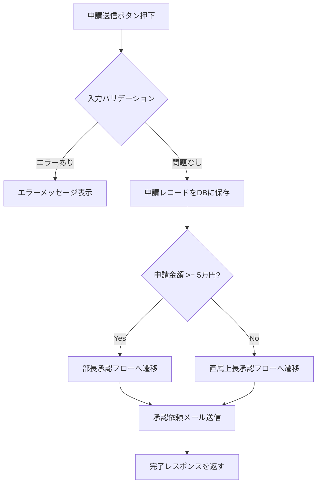
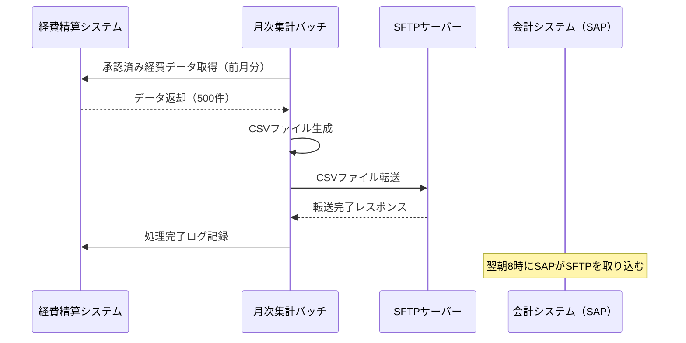

# 詳細設計 成果物 ツール・データ形式 選定ガイド

> **このファイルの目的**: 詳細設計フェーズで作成する各成果物（D-01〜D-18）について、ツールとデータ形式の選択肢を整理します。
> **凡例**: ◎ ベストな選択 ／ ○ 有力な選択肢 ／ △ 使えるが非推奨

---

## D-01. 詳細機能設計書（処理フロー・ロジック定義）

| 観点 | ツール | データ形式 |
|-----|-------|----------|
| 世界標準 | Confluence、Notion、Draw.io（フローチャート）、Mermaid、PlantUML（アクティビティ図） | Markdown、PNG、SVG |
| 日本の現場 | Excel、Word、PowerPoint（SmartArtフロー） | XLSX、DOCX、PPTX |
| ◎ ベスト | **Confluence または Notion（文書本体）＋ Mermaid または Draw.io（フローチャート）** | **Markdown ＋ PNG/SVG** |

**ベストを選ぶ理由**
- 処理ロジックは文章と図の組み合わせで表現するのが最も分かりやすい
- Mermaidはテキストでフローチャートを書けるため、Gitで変更履歴を追跡できる
- ConfluenceやNotionはMermaidをネイティブでレンダリングでき、図と説明文を同じページにまとめられる

**Mermaidによるフローチャート記述例**


> **Wordフロー図を使う場合の注意点**: Wordの SmartArt やテキストボックスで作ったフローは、図をPNGに書き出せないため設計書への貼り付けが手間になります。Draw.io や Mermaid に移行することを推奨します。

---

## D-02. 詳細画面設計書（全項目・バリデーション・エラーメッセージ一覧）

| 観点 | ツール | データ形式 |
|-----|-------|----------|
| 世界標準 | **Figma**（アノテーション機能）、Zeplin、Storybook（コンポーネント仕様）、Confluence | Figmaリンク、PNG、Markdown |
| 日本の現場 | Excel（項目一覧表）、Word、Figma（近年増加中） | XLSX、DOCX |
| ◎ ベスト | **Figma（レイアウト・アノテーション）＋ Excel または Notion（項目定義表）** | **Figmaリンク ＋ XLSX または Markdown** |

**ベストを選ぶ理由**
- Figmaのアノテーション機能でワイヤーフレーム上に直接「この項目は必須・最大50文字」と注釈を付けられる
- 項目定義表（バリデーションルール・エラーメッセージ一覧）はExcelの表が最も整理しやすい
- 両者をセットで管理することで、デザインと仕様が常に対応した状態を保てる

**推奨する項目定義表の構成（Excel）**

| 項目ID | 項目名 | 入力形式 | 文字種 | 最小文字数 | 最大文字数 | 必須 | 初期値 | バリデーション条件 | エラーメッセージ |
|-------|------|--------|------|---------|---------|-----|------|--------------|------------|
| SCR003-01 | 申請タイトル | テキスト | 全角・半角 | 1 | 100 | 必須 | （なし） | 空白のみ不可 | 申請タイトルを入力してください |
| SCR003-02 | 申請金額 | 数値 | 半角数字 | 1 | 7 | 必須 | （なし） | 1〜9,999,999の整数 | 金額は1円以上9,999,999円以下で入力してください |

**Storybookを使う場合（フロントエンドが React / Vue の場合）**
> Storybookはコンポーネントの状態（通常・エラー・非活性など）を一覧で確認できるツールです。詳細設計書の代わりにStorybookを「生きた仕様書」として運用するチームも増えています。

---

## D-03. 詳細API仕様書（OpenAPI完全版）

| 観点 | ツール | データ形式 |
|-----|-------|----------|
| 世界標準 | **OpenAPI 3.x（YAML）**、Stoplight Studio、Swagger UI、Redocly、Postman | YAML、JSON |
| 日本の現場 | Excel、Word（近年はOpenAPIへ移行が加速） | XLSX、DOCX |
| ◎ ベスト | **OpenAPI（YAML）＋ Stoplight Studio（編集・プレビュー）＋ Swagger UI（閲覧・共有）** | **YAML** |

**ベストを選ぶ理由**
- OpenAPI YAMLはGitで変更履歴を管理でき、フロントエンド・バックエンドの認識齟齬を防げる
- Stoplight Studioは、YAMLを直接書かなくてもGUIで入力できるため、SEが使いやすい
- Swagger UIで自動生成されたHTML仕様書はブラウザで動作確認（Try it out）ができ、フロントエンド担当との調整が効率化する
- モックサーバー（Prism）と組み合わせると、バックエンド実装前にフロントエンド開発を並行して進められる

**基本設計の概要版から完全版への移行ポイント**
- 全リクエストパラメータの型・必須/任意・説明を追記
- 全レスポンスフィールドの型・説明・サンプル値を追記
- エラーレスポンスのパターンを全ステータスコード分定義
- セキュリティスキーム（JWT等）の定義を追記

**モックサーバーの立て方（Prism）**
```bash
# Prismのインストール（Node.js が必要）
npm install -g @stoplight/prism-cli

# モックサーバー起動（api-spec.yaml をもとにモックAPIを自動生成）
prism mock api-spec.yaml

# → http://localhost:4010 でモックAPIにアクセスできる
```

> **フロントエンド担当への共有方法**: YAMLファイルをそのまま渡すのではなく、`npx @redocly/cli build-docs api-spec.yaml` でHTMLを生成して渡すか、Swagger UIをDockerで立ち上げて共有URLを案内するのが親切です。

---

## D-04. バッチ詳細設計書

| 観点 | ツール | データ形式 |
|-----|-------|----------|
| 世界標準 | Confluence、Notion、Draw.io（フローチャート）、Mermaid | Markdown、PNG |
| 日本の現場 | Excel、Word | XLSX、DOCX |
| ◎ ベスト | **Confluence または Notion（文書）＋ Mermaid または Draw.io（処理フロー図）** | **Markdown ＋ PNG** |

**ベストを選ぶ理由**
- バッチ設計書は処理フローと仕様説明の組み合わせ。D-01（詳細機能設計書）と同じ構成が適している
- バッチはエラー処理・リカバリが複雑になりやすいため、フロー図で可視化することが重要

**推奨する記載項目**

| 項目 | 内容 |
|-----|------|
| バッチID / バッチ名 | BAT-001 / 月次集計バッチ |
| 起動方式 | スケジューラ（cron） / 手動起動 |
| 実行タイミング | 毎月1日 1:00（JST） |
| 処理対象の抽出条件 | 前月1日〜末日の承認済み経費申請（status = 'approved'） |
| 処理手順 | フローチャートを参照 |
| エラー発生時の動作 | ① ログに出力 ② アラートメール送信 ③ 処理中断（部分コミットしない） |
| リカバリ手順 | 原因修正後、対象期間を指定して再実行する。再実行前に前回の処理結果を確認すること |
| 処理件数目安 | 月間500件（最大2,000件） |
| 実行所要時間の目安 | 通常5分以内 |

---

## D-05. 帳票詳細設計書

| 観点 | ツール | データ形式 |
|-----|-------|----------|
| 世界標準 | Figma（レイアウト）、Adobe XD、JasperReports Designer、BIRT | Figmaリンク、PNG |
| 日本の現場 | Excel（帳票レイアウト模擬）、Word、帳票ツール（SVF・JasperReports） | XLSX、DOCX |
| ◎ ベスト | **Excel（レイアウト確認用モック）＋ Confluence/Notion（仕様書）** | **XLSX ＋ Markdown** |

**ベストを選ぶ理由**
- 帳票レイアウトはExcelのセルを使って実際に近い見た目を作り、顧客に確認してもらうのが最も手っ取り早い
- 仕様書（出力条件・集計ロジック・ページ設定）はConfluenceやNotionで管理する
- 実装に使う帳票ツール（JasperReports・SVF等）は確定後に設計書と紐づける

**推奨する仕様書の記載項目**

| 項目 | 内容 |
|-----|------|
| 帳票ID / 帳票名 | RPT-001 / 月次経費精算書 |
| 出力トリガー | 経理担当が「月次出力」ボタンを押したとき |
| 出力対象データ | 指定月の承認済み経費申請（申請者ごとに集計） |
| ページ設定 | A4縦・余白 上下15mm 左右20mm |
| ソート順 | 申請者の社員番号昇順 |
| ページ制御 | 申請者が変わるたびに改ページ |
| 合計欄 | 申請者ごとの小計・全体合計を出力 |
| 実装ライブラリ | JasperReports 6.x |

---

## D-06. 物理ER図・物理データ設計書

| 観点 | ツール | データ形式 |
|-----|-------|----------|
| 世界標準 | dbdiagram.io（DBML）、DataGrip、DBeaver、MySQL Workbench、SchemaSpy（既存DB逆生成） | DBML、PNG、SVG |
| 日本の現場 | **A5:SQL Mk-2**（無料・日本語対応）、MySQL Workbench、Excel | PNG、XLSX |
| ◎ ベスト | **A5:SQL Mk-2（設計・Excel出力）または dbdiagram.io（DBML）** | **PNG ＋ XLSX（A5:SQL）/ DBML ＋ PNG（dbdiagram.io）** |

**ベストを選ぶ理由**
- A5:SQL Mk-2は日本語のコメント対応・Excel出力・DDL生成・差分ALTER文生成がすべてできる。日本の現場で最も導入コストが低い
- dbdiagram.ioはDBMLというテキスト形式で書けるため、Gitでバージョン管理できる。チームがGitに慣れている場合に有効

**物理設計で追加すべき情報（論理設計からの差分）**

| 追加項目 | 説明 |
|--------|------|
| 物理テーブル名 | スネークケースで命名（例: `expense_details`）|
| 物理カラム名 | 実DBに作るカラム名（例: `created_at`）|
| データ型の確定 | `VARCHAR(255)` / `BIGINT` / `TIMESTAMP` 等を具体的に決定 |
| 文字コード / 照合順序 | `utf8mb4` / `utf8mb4_unicode_ci` 等 |
| NULL制約 | `NOT NULL` / `NULL` を全カラムに明示 |
| デフォルト値 | `DEFAULT NOW()` / `DEFAULT 0` 等 |
| インデックス | どのカラムにどの種類のインデックスを張るか（→ D-07参照）|
| パーティション | 必要な場合のパーティションキーと分割方式 |

---

## D-07. インデックス設計書

| 観点 | ツール | データ形式 |
|-----|-------|----------|
| 世界標準 | Confluence、Notion（テーブル定義書と統合）、dbdiagram.io（アノテーション） | Markdown、XLSX |
| 日本の現場 | Excel（テーブル定義書と同一ファイル内のシート） | XLSX |
| ◎ ベスト | **Excel（D-06テーブル定義書と同一ファイルに統合）** | **XLSX** |

**ベストを選ぶ理由**
- インデックス設計はテーブル定義と密接に関連するため、同じExcelファイルの別シートとして管理するのが最も見通しがよい
- テーブル定義書とインデックス設計書を別ファイルにすると、変更時に両方を更新し忘れるリスクが高い

**推奨する記載項目**

| テーブル名 | インデックス名 | 種類 | 対象カラム | 設計理由 | 想定クエリ |
|---------|------------|-----|---------|--------|---------|
| expenses | idx_expenses_user_id | 通常 | user_id | 申請一覧画面でユーザーごとに申請を絞り込む | `WHERE user_id = ?` |
| expenses | idx_expenses_status_created | 複合 | status, created_at | 承認待ち一覧を作成日順で取得 | `WHERE status = 'submitted' ORDER BY created_at` |
| users | uq_users_email | ユニーク | email | メールアドレスの重複登録を防止 | — |

**インデックス設計の判断基準**
- `WHERE` 句・`JOIN` 条件・`ORDER BY` によく登場するカラムに張る
- カーディナリティ（値の種類数）が低いカラム（例: 性別フラグ）には効果が薄い
- 更新頻度が高いテーブルのインデックスは張りすぎると INSERT / UPDATE が遅くなる

---

## D-08. 主要クエリ設計書（SQL一覧）

| 観点 | ツール | データ形式 |
|-----|-------|----------|
| 世界標準 | Gitリポジトリ（SQLファイル）、DataGrip、DBeaver、Confluence（説明付き） | SQL、Markdown |
| 日本の現場 | Excel、Word（SQLを貼り付け）、A5:SQL Mk-2 | XLSX、DOCX |
| ◎ ベスト | **SQLファイルとしてGitで管理 ＋ Confluence/Notion（クエリの説明）** | **SQL ＋ Markdown** |

**ベストを選ぶ理由**
- SQLファイルはテキスト形式のため、Gitで変更履歴を正確に追跡できる
- `docs/sql/` ディレクトリにクエリを分類して保存し、Confluenceで用途の説明を書くと調査しやすい
- ExcelにSQLを貼る運用はインデントが崩れ、SQLとして実行できない状態になりやすい

**推奨するディレクトリ構成**
```
docs/
└── sql/
    ├── queries/
    │   ├── expenses_list.sql        ← 申請一覧取得
    │   ├── expenses_detail.sql      ← 申請詳細取得
    │   └── monthly_summary.sql      ← 月次集計
    └── README.md                    ← クエリ一覧インデックス
```

**クエリ設計書のREADME.md 構成例**
```markdown
## クエリ一覧

| ファイル名 | 用途 | 使用箇所 | 備考 |
|---------|-----|--------|-----|
| expenses_list.sql | 申請一覧取得（ページネーション対応） | 申請一覧API (GET /expenses) | N+1対策でJOINを使用 |
| monthly_summary.sql | 月次集計バッチ用 | BAT-001 月次集計バッチ | 実行時間: 通常2秒以内 |
```

---

## D-09. マイグレーションスクリプト（SQL DDL）

| 観点 | ツール | データ形式 |
|-----|-------|----------|
| 世界標準 | **Flyway**（Java系）、**Liquibase**（言語非依存）、Alembic（Python）、Prisma Migrate（Node.js） | SQL、YAML、XML |
| 日本の現場 | SQLファイルを手動管理、A5:SQL Mk-2でDDL生成、Flyway（近年増加） | SQL |
| ◎ ベスト | **Flyway（Java/Spring Boot プロジェクト）** または **Liquibase（言語非依存）** | **SQL（Flyway）/ SQL または YAML（Liquibase）** |

**ベストを選ぶ理由**
- Flywayは「どのマイグレーションがDBに適用済みか」を自動追跡する。手動管理では「このSQLはもう実行したっけ？」という問題が必ず起きる
- Spring Bootとの統合が容易で、アプリ起動時に未適用のマイグレーションを自動で実行できる
- SQLファイル形式のため、既存のSQLスキルで書ける（新しい記法の習得不要）

**Flywayのファイル命名規則**
```
V[バージョン番号]__[説明].sql

例:
V001__create_initial_tables.sql     ← 初回: 全テーブルのCREATE TABLE
V002__add_phone_number_to_users.sql ← カラム追加
V003__add_index_to_expenses.sql     ← インデックス追加
V004__create_approvals_table.sql    ← テーブル追加
```

> `__`（アンダースコア2つ）が区切り文字です。1つでは動きません。

**ファイルの中身の例（V002）**
```sql
-- V002__add_phone_number_to_users.sql
-- users テーブルに電話番号カラムを追加
ALTER TABLE users
  ADD COLUMN phone_number VARCHAR(20) NULL COMMENT '電話番号' AFTER email;
```

**手動管理からFlywayへ移行する場合**
```
① 現状のDBスキーマを A5:SQL Mk-2 などで CREATE TABLE として出力
② そのSQLを V001__create_initial_tables.sql として保存
③ Flyway の baseline コマンドで「V001 は適用済み」とマークする
④ 以降の変更は V002__ 以降のファイルで管理する
```

---

## D-10. 詳細外部インタフェース設計書

| 観点 | ツール | データ形式 |
|-----|-------|----------|
| 世界標準 | OpenAPI（REST API連携）、AsyncAPI（非同期・メッセージング連携）、Confluence | YAML、Markdown |
| 日本の現場 | Excel、Word | XLSX、DOCX |
| ◎ ベスト | **REST API連携 → OpenAPI（YAML）** / **ファイル・その他連携 → Excel** | **YAML or XLSX（連携方式による）** |

**ベストを選ぶ理由**
- 基本設計と同じ判断基準。詳細設計では項目レベルの仕様を加えて充実させる
- 特にファイル連携（CSV等）は項目定義を詳細化することが重要

**詳細設計フェーズで追加すべき内容**

| 追加項目 | 内容 |
|--------|------|
| 全項目の型・桁数・必須/任意 | 基本設計の項目一覧に型情報を追記 |
| コード値の定義 | 区分値の全パターンと意味 |
| 異常データの扱い | 不正データが来た場合のスキップ/エラー停止方針 |
| 文字コード・改行コード | UTF-8 / Shift_JIS、CR+LF / LF の指定 |
| ヘッダー行の有無 | CSVの場合は1行目の扱いを明示 |
| タイムゾーン | 日時データのタイムゾーン（JST / UTC）を明示 |

---

## D-11. 連携シーケンス図

| 観点 | ツール | データ形式 |
|-----|-------|----------|
| 世界標準 | **Mermaid**（sequenceDiagram）、**PlantUML**、Draw.io、Lucidchart | Markdown（Mermaid）、PNG、SVG |
| 日本の現場 | Excel、PowerPoint、Draw.io | XLSX、PPTX、PNG |
| ◎ ベスト | **Mermaid（テキスト管理）または PlantUML** | **MarkdownファイルとしてGit管理 ＋ PNG（設計書貼付用）** |

**ベストを選ぶ理由**
- Mermaid / PlantUMLはテキスト形式のため、Gitで変更履歴を追跡できる
- ConfluenceやNotionでネイティブレンダリングできるため、別途画像を貼り直す手間がない
- 複雑な図の場合はDraw.ioで描いてPNGエクスポートする方が見やすい場合もある

**Mermaidによるシーケンス図の記述例**


**PlantUMLとMermaidの使い分け**
| 観点 | Mermaid | PlantUML |
|-----|--------|--------|
| 記法のシンプルさ | ★★★ 簡単 | ★★☆ やや複雑 |
| 表現力 | ★★☆ | ★★★ 豊富 |
| Confluenceとの統合 | ネイティブ対応 | プラグイン必要 |
| ローカル生成 | Node.js必要 | Java必要 |

> **迷ったらMermaidを選んでください。** 記法がシンプルで、GitHubやConfluenceでそのまま表示できます。

---

## D-12. 詳細セキュリティ設計書

| 観点 | ツール | データ形式 |
|-----|-------|----------|
| 世界標準 | Confluence、Notion、**OWASP Threat Dragon**（脅威モデリング）、Draw.io（データフロー図） | Markdown、PNG |
| 日本の現場 | Word、Excel | DOCX、XLSX |
| ◎ ベスト | **Confluence または Notion（設計書本文）＋ OWASP Threat Dragon（脅威モデリング）** | **Markdown ＋ PNG** |

**ベストを選ぶ理由**
- OWASP Threat Dragonは無料OSSのツールで、データフロー図（DFD）を描きながら脅威を体系的に洗い出せる
- 詳細設計フェーズでは実装レベルの対策まで記述するため、箇条書きと表が混在するConfluenceが管理しやすい

**詳細設計フェーズで記述すべき内容（基本設計からの追加分）**

| セクション | 基本設計 | 詳細設計で追加する内容 |
|---------|--------|-----------------|
| 認証 | JWTを使う方針 | トークン生成ライブラリ・署名アルゴリズム（RS256等）・鍵管理方法・リフレッシュ実装方式 |
| パスワード | bcryptを使う方針 | ストレッチング回数（コスト係数）・保存フォーマット |
| 入力検証 | サーバーサイドで検証する方針 | バリデーションライブラリ名・実装パターン・全バリデーション項目一覧 |
| 監査ログ | 監査ログを取る方針 | ログのJSON構造・ログに含めるフィールド・ログに含めてはいけないフィールド |
| 通信暗号化 | HTTPS / TLS 1.2以上の方針 | 証明書の種類・更新手順・HSTSヘッダーの設定値 |

---

## D-13. 単体テスト設計書（テストケース観点・方針）

| 観点 | ツール | データ形式 |
|-----|-------|----------|
| 世界標準 | Confluence、Notion、TestRail、Zephyr Scale（Jira連携）、GitHub Wiki | Markdown、XLSX |
| 日本の現場 | Excel（テストケース一覧） | XLSX |
| ◎ ベスト | **Excel（テストケース一覧）＋ Confluence/Notion（テスト方針書）** | **XLSX ＋ Markdown** |

**ベストを選ぶ理由**
- テストケース一覧（No・観点・入力・期待結果・Pass/Fail）はExcelの表管理が最も扱いやすい
- テスト方針（カバレッジ目標・フレームワーク・実行方法）はConfluenceやNotionで文書化する

**推奨テストケース一覧の構成（Excel）**

| No | 対象機能 | テスト観点 | 入力値・前提条件 | 期待結果 | 種別 | 優先度 | 結果 |
|----|--------|---------|-------------|--------|-----|------|-----|
| UT-001 | 経費申請作成 | 正常：全必須項目入力 | 全必須項目に有効な値を入力 | 申請がDraft状態で保存され201が返る | 正常系 | 高 | — |
| UT-002 | 経費申請作成 | 異常：タイトル未入力 | タイトルを空白にして送信 | 400エラーとエラーメッセージが返る | 異常系 | 高 | — |
| UT-003 | 経費申請作成 | 境界値：金額最大 | 金額に9,999,999を入力 | 正常に保存される | 境界値 | 中 | — |
| UT-004 | 経費申請作成 | 境界値：金額最大+1 | 金額に10,000,000を入力 | 400エラーが返る | 境界値 | 中 | — |

**テストフレームワークの選定**

| 技術 | 単体テストFW | モックライブラリ |
|-----|-----------|------------|
| Java / Spring Boot | JUnit 5 ＋ Spring Boot Test | Mockito |
| Python | pytest | unittest.mock |
| Node.js / TypeScript | Jest | Jest（内蔵） |
| React | Jest ＋ React Testing Library | Jest（内蔵） |
| Vue.js | Vitest ＋ Vue Test Utils | Vitest（内蔵） |

---

## D-14. 結合テスト設計方針書

| 観点 | ツール | データ形式 |
|-----|-------|----------|
| 世界標準 | Confluence、Notion、TestRail、Postman（APIテスト自動化） | Markdown、XLSX |
| 日本の現場 | Excel、Word | XLSX、DOCX |
| ◎ ベスト | **Confluence または Notion（方針書）＋ Excel（テストケース一覧）＋ Postman（APIテスト自動化）** | **Markdown ＋ XLSX** |

**ベストを選ぶ理由**
- 結合テストの「方針・観点・環境・スケジュール」はConfluenceやNotionで文書化するのが適している
- テストケース一覧はExcelが扱いやすい（D-13と同じ構成でよい）
- PostmanはAPIの結合テストを自動化でき、テスト結果をHTML形式で出力できる

**方針書の推奨記載項目**

| 項目 | 内容の例 |
|-----|--------|
| テスト対象範囲 | 全APIエンドポイント + 主要な画面操作シナリオ |
| テスト環境 | ステージング環境（AWS ECS + RDS）|
| テストデータ準備方法 | Flyway seedデータを使用。テスト前にDBをリセットする |
| 外部連携の扱い | 会計システムはスタブに差し替え。メール送信はモック化 |
| 自動化方針 | APIテストはPostmanコレクションで自動化。画面テストは手動 |
| 合格基準 | 全テストケースPass ＋ 単体テストカバレッジ80%以上 |

---

## D-15. コーディング規約書

| 観点 | ツール | データ形式 |
|-----|-------|----------|
| 世界標準 | **Gitリポジトリ内のMarkdownファイル**、Confluence、ESLint/Checkstyle（ルール設定ファイル）、EditorConfig | Markdown、JSON/YAML（設定ファイル） |
| 日本の現場 | Word、Excel、Confluence | DOCX、XLSX |
| ◎ ベスト | **`docs/coding-standards.md` としてGitリポジトリに含める ＋ Linter設定ファイルで自動化** | **Markdown ＋ JSON/YAML（設定ファイル）** |

**ベストを選ぶ理由**
- コーディング規約はコードと同じリポジトリに入れることで、開発者が参照しやすく更新も一元管理できる
- Linter（ESLint・Checkstyle・Ruff等）の設定ファイルとセットで管理することで、規約を「読むもの」ではなく「自動チェックされるもの」にできる
- WordやExcelで管理すると、規約が更新されてもLinterに反映されず形骸化する

**規約書とLinter設定の対応例（TypeScript/ESLintの場合）**

| 規約の内容 | 文書での記載 | .eslintrc での設定 |
|---------|-----------|----------------|
| 変数名はcamelCase | `変数名はcamelCase形式で命名する` | `"camelcase": "error"` |
| console.logは本番コードに残さない | `console.logはデバッグ用途に限り、PRマージ前に削除する` | `"no-console": "warn"` |
| 未使用のimportは削除する | `未使用のimport文は残さない` | `"no-unused-vars": "error"` |

**`.editorconfig` の活用**
> `.editorconfig` はエディタの種類（VS Code・IntelliJ等）に関わらず、インデントや改行コードを統一するためのファイルです。リポジトリのルートに置くだけで機能します。
```ini
root = true

[*]
charset = utf-8
indent_style = space
indent_size = 2
end_of_line = lf
trim_trailing_whitespace = true
insert_final_newline = true

[*.java]
indent_size = 4
```

---

## D-16. 開発環境構築手順書

| 観点 | ツール | データ形式 |
|-----|-------|----------|
| 世界標準 | **README.md**（リポジトリルート）、**Dev Containers**（VS Code）、Docker Compose、Confluence | Markdown、YAML |
| 日本の現場 | Word、Excel、Confluence | DOCX、XLSX |
| ◎ ベスト | **`README.md` + `docker-compose.yml` + `.devcontainer/`（任意）** | **Markdown ＋ YAML** |

**ベストを選ぶ理由**
- `README.md` はリポジトリを開いた全員が最初に目にするファイル。環境構築手順を書く場所として最も自然
- Docker Composeを使うことで「手順書通りにコマンドを叩けば誰の環境でも動く」状態を実現できる
- Dev Containers（VS Codeの拡張機能）を使うと、コンテナ内で開発環境が完結し、OSの違いによる「自分の環境では動く」問題がなくなる

**README.md の推奨構成**
```markdown
## 開発環境のセットアップ

### 前提条件
- Docker Desktop 4.x 以上
- Node.js 20.x 以上（フロントエンド開発のみ）

### 手順
1. リポジトリをクローンする
   ```bash
   git clone https://github.com/your-org/your-project.git
   cd your-project
   ```
2. 環境変数ファイルを作成する
   ```bash
   cp .env.example .env
   # .env の中身を確認し、必要に応じて編集する
   ```
3. Dockerコンテナを起動する
   ```bash
   docker compose up -d
   ```
4. DBマイグレーションを実行する
   ```bash
   docker compose exec app ./gradlew flywayMigrate
   ```
5. ブラウザで http://localhost:3000 を開いて動作確認する

### よくあるトラブル
| 症状 | 対処法 |
|-----|------|
| ポート3000が使用中 | .env の PORT を変更する |
| DBに接続できない | docker compose ps でDBコンテナが起動しているか確認 |
```

**Dev Containersを使う場合の効果**
> `.devcontainer/devcontainer.json` をリポジトリに含めると、VS Codeで「コンテナで再度開く」を選ぶだけで全開発者が同一の開発環境を使える状態になります。Node.jsのバージョン違いやJDKのインストール漏れが原因のトラブルがなくなります。

---

## D-17. 詳細設計書（総括）

| 観点 | ツール | データ形式 |
|-----|-------|----------|
| 世界標準 | Confluence（ページ集約）、Notion（リンクドページ）、GitBook | Markdownサイト、HTML |
| 日本の現場 | Word（全章を1ファイルに統合）、PDF提出 | DOCX、PDF |
| ◎ ベスト | **Confluence または Notion（各設計書をリンクで統合）＋ PDF（顧客提出用）** | **Confluenceページ ＋ PDF** |

**ベストを選ぶ理由**
- 基本設計書（総括）と同じ理由。各設計書を更新するたびに総括書を編集し直す必要がなく、リンクで束ねる方が保守しやすい
- 顧客への提出時はConfluenceからPDFを出力することで正式な提出物に対応できる

**推奨ページ構成（Confluenceの場合）**
```
詳細設計書
├── はじめに（目的・対象・版数管理・改訂履歴）
├── D-01 詳細機能設計書（ページリンク）
├── D-02 詳細画面設計書（ページリンク）
├── D-03 詳細API仕様書（OpenAPIリンク or Swagger UIリンク）
├── D-04 バッチ詳細設計書（ページリンク、該当する場合）
├── D-05 帳票詳細設計書（ページリンク、該当する場合）
├── D-06〜D-09 データ設計（ページリンク）
├── D-10〜D-11 外部インタフェース設計（ページリンク）
├── D-12 詳細セキュリティ設計書（ページリンク）
├── D-13〜D-14 テスト設計書（ページリンク）
├── D-15〜D-16 開発規約・環境（GitHubリンク）
└── 未決事項・変更履歴
```

---

## D-18. 更新版トレーサビリティマトリクス

| 観点 | ツール | データ形式 |
|-----|-------|----------|
| 世界標準 | Jira（課題リンク）、Confluence、Spreadsheet | CSV、XLSX |
| 日本の現場 | Excel | XLSX |
| ◎ ベスト | **Excel** | **XLSX** |

**ベストを選ぶ理由**
- 基本設計から詳細設計で粒度が細かくなっているため、要件→基本設計→詳細設計の3層を紐づける必要がある
- Excelの行列管理がシンプルで最も扱いやすい

**推奨構成（詳細設計フェーズ版）**

| 要件ID | 要件名 | 基本設計ID | 基本設計項目 | 詳細設計ID | 詳細設計項目 | テストケースID | 確認 |
|------|------|---------|----------|---------|----------|------------|-----|
| REQ-001 | 経費申請機能 | B-03/F-001 | 機能一覧 F-001 | D-01/D-02/D-03 | 詳細機能設計・画面設計・API仕様 | UT-001〜005 | ✓ |
| REQ-002 | 承認ワークフロー | B-03/F-002 | 機能一覧 F-002 | D-01/D-03 | 詳細機能設計・API仕様 | UT-010〜018 | ✓ |

---

## まとめ：詳細設計フェーズのツール選定方針

| 成果物の種類 | 推奨ツール |
|-----------|---------|
| **処理フロー・シーケンス図** | Mermaid（テキスト） or Draw.io（複雑な図） |
| **画面定義・バリデーション** | Figma（レイアウト）＋ Excel（項目定義表） |
| **API仕様** | OpenAPI（YAML）＋ Stoplight Studio or Swagger UI |
| **データ設計（物理ER図）** | A5:SQL Mk-2 or dbdiagram.io |
| **マイグレーション管理** | Flyway（Java）or Liquibase |
| **テスト設計** | Excel（テストケース）＋ Confluence（方針書） |
| **コーディング規約** | Markdownファイル（Git管理）＋ Linter設定 |
| **開発環境手順書** | README.md ＋ Docker Compose |
| **設計書・仕様文書** | Confluence or Notion（Markdown） |
| **顧客提出用** | PDF（Confluenceからエクスポート）|

> **詳細設計フェーズの基本原則**: 「Gitで管理できるものはGitで管理する」。フローチャートはMermaid、API仕様はOpenAPI YAML、SQLはSQLファイル、コーディング規約はMarkdownとして、すべてリポジトリに含めることで「設計書とコードが同じ場所にある」状態を作ることが理想です。
