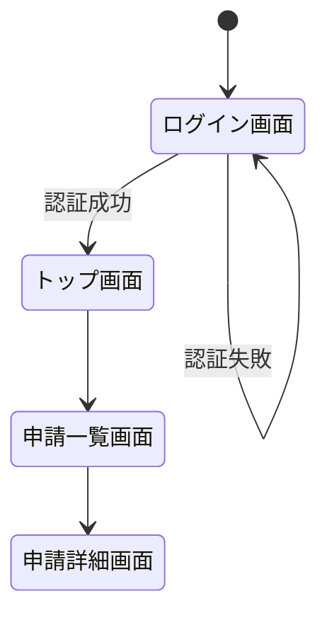

## B-03. 機能一覧（設計版）

| 観点 | ツール | データ形式 |
|-----|-------|----------|
| 世界標準 | Confluence、Notion、Jira（エピック・ストーリー管理） | Markdown、CSV |
| 日本の現場 | Excel | XLSX |
| ◎ ベスト | **Excel または Notion** | **XLSX（Excel）／ CSV（機械処理用）** |

**ベストを選ぶ理由**
- 機能一覧は表形式が最も見やすく、ExcelかNotionのデータベース機能が適している
- Excelはフィルタ・ソートが使いやすく、顧客への提出にも適している
- Notionは複数人での同時編集・ステータス管理が得意

**推奨カラム構成**

| 機能ID | 機能名 | 概要 | UI種別 | 優先度 | 担当者 | ステータス |
|-------|-------|-----|-------|------|-------|---------|
| F-001 | 経費申請 | 経費を申請する | 画面 | 必須 | 〇〇 | 設計中 |

> UI種別は「画面 / バッチ / 帳票 / API」で明示し、漏れを防ぎます。

---

## B-04. 画面一覧

| 観点 | ツール | データ形式 |
|-----|-------|----------|
| 世界標準 | Confluence、Notion、Figma（サイトマップ機能） | Markdown、CSV |
| 日本の現場 | Excel | XLSX |
| ◎ ベスト | **Excel** | **XLSX** |

**ベストを選ぶ理由**
- 画面一覧はシンプルな表管理で十分。Excel が最も汎用性が高い
- 後工程の画面レイアウト定義書（B-05）と同じファイルのシートとして管理すると一元化できる

**推奨カラム構成**

| 画面ID | 画面名 | 対応機能ID | 遷移元 | 遷移先 | 備考 |
|-------|-------|----------|------|------|-----|
| SCR-001 | ログイン画面 | F-001 | （なし） | SCR-002 | 未ログイン時のデフォルト |

---

## B-05. 画面レイアウト定義書（ワイヤーフレーム）

| 観点 | ツール | データ形式 |
|-----|-------|----------|
| 世界標準 | **Figma**、Sketch、Adobe XD、Balsamiq、Miro | Figmaリンク、PNG、SVG |
| 日本の現場 | Excel（罫線でレイアウト）、PowerPoint、Figma（近年急増中） | XLSX、PPTX |
| ◎ ベスト | **Figma** | **Figmaリンク（共有URL）＋PNG（設計書貼り付け用）** |

**ベストを選ぶ理由**
- チームでのリアルタイム共同編集が可能
- コメント機能でレビューのやり取りができる
- 「Inspect」機能でエンジニアがCSSやサイズを直接参照でき、詳細設計以降の工数が削減できる
- 無料プランでも基本設計レベルには十分対応できる

**Excelワイヤーフレームを使う場合の注意点**
> ExcelはレイアウトをPNGにエクスポートできないため、スクリーンショットを設計書に貼る運用になりがちです。修正のたびに貼り直しが発生するため、工数がかかります。

---

## B-06. 画面遷移図（設計版）

| 観点 | ツール | データ形式 |
|-----|-------|----------|
| 世界標準 | Figma（プロトタイプ機能）、Draw.io、Mermaid（stateDiagram） | Figmaリンク、PNG、SVG |
| 日本の現場 | Excel、PowerPoint、Cacoo | XLSX、PPTX |
| ◎ ベスト | **Figma（ワイヤーフレームと統合）または Draw.io** | **Figmaリンク or PNG** |

**ベストを選ぶ理由**
- Figmaでワイヤーフレームとプロトタイプをセットで管理すると、画面と遷移が常に一致した状態を保てる
- 単独で遷移図だけ作る場合はDraw.ioが軽量で使いやすい

**Mermaid記法の例（テキストで管理したい場合）**


---

## B-07. API一覧 / API仕様書（概要版）

| 観点 | ツール | データ形式 |
|-----|-------|----------|
| 世界標準 | **OpenAPI（Swagger）**、Postman、Stoplight Studio、Redocly | YAML、JSON |
| 日本の現場 | Excel、Word（近年はSwagger・OpenAPIへ移行中） | XLSX、DOCX |
| ◎ ベスト | **OpenAPI（YAML形式）＋ Stoplight Studio または Swagger UI** | **YAML** |

**ベストを選ぶ理由**
- OpenAPI仕様書はYAMLで書くと人間にも読みやすく、Gitでバージョン管理できる
- Swagger UIやStoplight Studioで自動的にHTML形式のドキュメントに変換できる
- Postman・クライアントコードの自動生成ツールとの連携が可能

**基本設計フェーズでのOpenAPIの使い方**
> 基本設計では詳細なリクエスト/レスポンス定義まで不要です。エンドポイント・HTTPメソッド・概要・主要パラメータを記載した「概要版」として作成し、詳細設計フェーズで肉付けするアプローチが効率的です。

**OpenAPI最小構成の例**
```yaml
openapi: 3.0.3
info:
  title: 経費精算API
  version: 1.0.0
paths:
  /expenses:
    get:
      summary: 経費申請一覧取得
      description: ログインユーザーの経費申請一覧を返す
      responses:
        '200':
          description: 成功
    post:
      summary: 経費申請作成
      description: 新規経費申請を作成する
      responses:
        '201':
          description: 作成成功
```

---

### OpenAPI（YAML）を非エンジニア向けの資料に変換する方法

YAMLファイルそのままでは非エンジニアには読みにくいため、用途に応じて以下の形式に変換します。

---

#### 方法① Redoc → HTML／PDF（最も手軽・環境構築不要）

**Redoc** は OpenAPI の YAML ファイルを、見やすいWebページに自動変換するツールです。HTMLファイルを1つ作るだけで完結します。

**手順**

```
① 以下の内容で index.html を作成し、api-spec.yaml と同じフォルダに置く
② index.html をブラウザで開く → API仕様書が表示される
③ ブラウザの印刷機能（Ctrl+P）→「PDFに保存」で PDF として出力できる
```

**index.html の内容**
```html
<!DOCTYPE html>
<html>
<head>
  <title>API仕様書</title>
  <meta charset="utf-8"/>
</head>
<body>
  <redoc spec-url='api-spec.yaml'></redoc>
  <script src="https://cdn.redoc.ly/redoc/latest/bundles/redoc.standalone.js"></script>
</body>
</html>
```

> **これが最もシンプルな方法です。** ファイル2つ（index.html と api-spec.yaml）を同じフォルダに置いてブラウザで開くだけです。ただしインターネット接続が必要です（スクリプトをオンラインから読み込むため）。

**Redocが生成するページの構成**
```
左ペイン: APIの目次（エンドポイント一覧）
右ペイン: 各APIの詳細
  ・API名・説明文
  ・HTTPメソッドとURL（例: GET /expenses）
  ・リクエストパラメータの説明
  ・レスポンスの説明とサンプル
```

---

#### 方法② Stoplight Studio（GUIツール ― 非エンジニアも操作できる）

**Stoplight Studio** は OpenAPI の YAML をグラフィカルな画面で閲覧・編集できる無料ツールです。YAMLを直接見せるより格段に分かりやすくなります。

```
① Stoplight Studio をインストール（無料・Windows/Mac対応）
② api-spec.yaml ファイルを Stoplight Studio で開く
③ 「Preview」タブで非エンジニア向けの閲覧ビューが表示される
④ 顧客と画面を共有しながらレビューする
```

> 非エンジニアの顧客にAPIの概要をレビューしてもらう際に、Stoplight のプレビュー画面を一緒に見ながら説明するのが効果的です。

---

#### 方法③ Excel変換（PowerShellスクリプト ― 「Excelで渡してほしい」場合）

HTMLやPDFではなく「Excelで渡したい」場合は、以下のPowerShellスクリプトでAPI一覧をCSV（Excelで開ける形式）に変換できます。

**前提**: Windows PowerShell 5.1以上（Windows標準。インストール不要）

**`openapi-to-csv.ps1`**
```powershell
# openapi-to-csv.ps1
# OpenAPI の YAML ファイルを読み取り、API一覧を CSV に変換する
# 出力した CSV は Excel で開いて使用する

param(
    [string]$YamlFile = "api-spec.yaml",
    [string]$OutFile  = "api-list.csv"
)

$content = Get-Content $YamlFile -Encoding UTF8
$rows    = @()
$rows   += '"No.","HTTPメソッド","エンドポイント","概要","説明"'
$no      = 1
$path    = ""
$method  = ""
$summary = ""
$desc    = ""

foreach ($line in $content) {
    if ($line -match "^  (/\S+):") {
        $path = $Matches[1]
    }
    elseif ($line -match "^    (get|post|put|patch|delete):") {
        # 前のメソッドにdescriptionがなかった場合の出力
        if ($method -ne "" -and $summary -ne "") {
            $rows += """$no"",""$method"",""$path"",""$summary"",""$desc"""
            $no++
        }
        $method  = $Matches[1].ToUpper()
        $summary = ""
        $desc    = ""
    }
    elseif ($line -match "^\s+summary:\s+(.+)") {
        $summary = $Matches[1].Trim()
    }
    elseif ($line -match "^\s+description:\s+(.+)") {
        $desc = $Matches[1].Trim()
        if ($method -ne "" -and $summary -ne "") {
            $rows += """$no"",""$method"",""$path"",""$summary"",""$desc"""
            $no++
            $method = ""
        }
    }
}
# 末尾のAPIが description なしで終わっている場合の出力
if ($method -ne "" -and $summary -ne "") {
    $rows += """$no"",""$method"",""$path"",""$summary"",""$desc"""
}

$rows | Set-Content -Path $OutFile -Encoding UTF8
Write-Host "✔ $OutFile を出力しました"
Write-Host "  Excelで開く: ファイルを右クリック → プログラムから開く → Excel"
```

**実行方法**
```
powershell -ExecutionPolicy Bypass -File openapi-to-csv.ps1
```

**出力されるCSVをExcelで開いた場合のイメージ**

| No. | HTTPメソッド | エンドポイント | 概要 | 説明 |
|----|------------|------------|-----|-----|
| 1 | GET | /expenses | 経費申請一覧取得 | ログインユーザーの経費申請一覧を返す |
| 2 | POST | /expenses | 経費申請作成 | 新規経費申請を作成する |

> **CSVをExcelで開く方法**: CSVファイルを右クリック→「プログラムから開く」→「Excel」を選択。文字化けする場合は、Excelを起動して「データ」タブ→「テキスト/CSVから」→文字コード「UTF-8」を選択してインポートしてください。

---

#### 方法の選び方まとめ

| 目的 | 推奨する方法 | 手間 |
|-----|-----------|-----|
| 顧客へのレビュー用資料（きれいに見せたい） | 方法① Redoc → PDF | ★☆☆ |
| 顧客と画面を見ながら口頭説明する | 方法② Stoplight Studio | ★☆☆ |
| 「Excelで一覧を渡してほしい」と言われた | 方法③ PowerShellスクリプト | ★★☆ |
| エンジニア向け共有（変換不要） | YAML のまま Swagger UI で表示 | ★☆☆ |

> **まずは方法①（Redoc）から試してください。** HTMLファイルを1つ作るだけで、ブラウザで見やすいAPI仕様書が完成します。顧客へのレビューであれば PDF に印刷して渡すだけで十分なケースがほとんどです。

---

## B-08. バッチ一覧

| 観点 | ツール | データ形式 |
|-----|-------|----------|
| 世界標準 | Confluence、Notion | Markdown、CSV |
| 日本の現場 | Excel | XLSX |
| ◎ ベスト | **Excel** | **XLSX** |

**ベストを選ぶ理由**
- バッチ一覧は機能一覧と同様のシンプルな表管理で十分
- 機能一覧（B-03）のUI種別「バッチ」で管理する方法もあり、別ファイルにする必要がない場合も多い

**推奨カラム構成**

| バッチID | バッチ名 | 概要 | 起動方式 | 実行頻度・時刻 | 処理対象件数目安 | 異常時対応 |
|--------|--------|-----|--------|------------|-------------|---------|
| BAT-001 | 月次集計バッチ | 経費データを月次集計する | スケジューラ | 毎月1日 1:00 | 〜5,000件 | アラート通知 |

---
