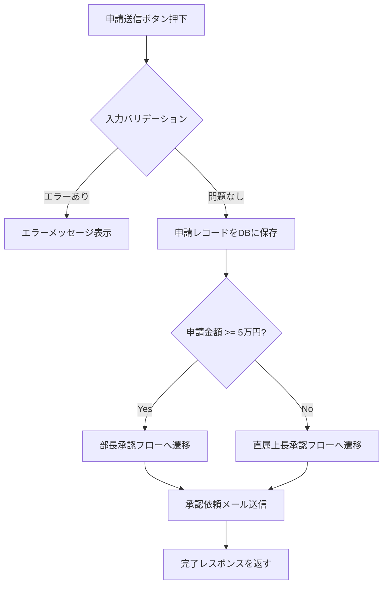

# 詳細設計 成果物 ツール・データ形式 選定ガイド

> **このファイルの目的**: 詳細設計フェーズで作成する各成果物（D-01〜D-18）について、ツールとデータ形式の選択肢を整理します。
> **凡例**: ◎ ベストな選択 ／ ○ 有力な選択肢 ／ △ 使えるが非推奨

---

## D-01. 詳細機能設計書（処理フロー・ロジック定義）

| 観点 | ツール | データ形式 |
|-----|-------|----------|
| 世界標準 | Confluence、Notion、Draw.io（フローチャート）、Mermaid、PlantUML（アクティビティ図） | Markdown、PNG、SVG |
| 日本の現場 | Excel、Word、PowerPoint（SmartArtフロー） | XLSX、DOCX、PPTX |
| ◎ ベスト | **Confluence または Notion（文書本体）＋ Mermaid または Draw.io（フローチャート）** | **Markdown ＋ PNG/SVG** |

**ベストを選ぶ理由**
- 処理ロジックは文章と図の組み合わせで表現するのが最も分かりやすい
- Mermaidはテキストでフローチャートを書けるため、Gitで変更履歴を追跡できる
- ConfluenceやNotionはMermaidをネイティブでレンダリングでき、図と説明文を同じページにまとめられる

**Mermaidによるフローチャート記述例**


> **Wordフロー図を使う場合の注意点**: Wordの SmartArt やテキストボックスで作ったフローは、図をPNGに書き出せないため設計書への貼り付けが手間になります。Draw.io や Mermaid に移行することを推奨します。

---

## D-02. 詳細画面設計書（全項目・バリデーション・エラーメッセージ一覧）

| 観点 | ツール | データ形式 |
|-----|-------|----------|
| 世界標準 | **Figma**（アノテーション機能）、Zeplin、Storybook（コンポーネント仕様）、Confluence | Figmaリンク、PNG、Markdown |
| 日本の現場 | Excel（項目一覧表）、Word、Figma（近年増加中） | XLSX、DOCX |
| ◎ ベスト | **Figma（レイアウト・アノテーション）＋ Excel または Notion（項目定義表）** | **Figmaリンク ＋ XLSX または Markdown** |

**ベストを選ぶ理由**
- Figmaのアノテーション機能でワイヤーフレーム上に直接「この項目は必須・最大50文字」と注釈を付けられる
- 項目定義表（バリデーションルール・エラーメッセージ一覧）はExcelの表が最も整理しやすい
- 両者をセットで管理することで、デザインと仕様が常に対応した状態を保てる

**推奨する項目定義表の構成（Excel）**

| 項目ID | 項目名 | 入力形式 | 文字種 | 最小文字数 | 最大文字数 | 必須 | 初期値 | バリデーション条件 | エラーメッセージ |
|-------|------|--------|------|---------|---------|-----|------|--------------|------------|
| SCR003-01 | 申請タイトル | テキスト | 全角・半角 | 1 | 100 | 必須 | （なし） | 空白のみ不可 | 申請タイトルを入力してください |
| SCR003-02 | 申請金額 | 数値 | 半角数字 | 1 | 7 | 必須 | （なし） | 1〜9,999,999の整数 | 金額は1円以上9,999,999円以下で入力してください |

**Storybookを使う場合（フロントエンドが React / Vue の場合）**
> Storybookはコンポーネントの状態（通常・エラー・非活性など）を一覧で確認できるツールです。詳細設計書の代わりにStorybookを「生きた仕様書」として運用するチームも増えています。

---

## D-03. 詳細API仕様書（OpenAPI完全版）

| 観点 | ツール | データ形式 |
|-----|-------|----------|
| 世界標準 | **OpenAPI 3.x（YAML）**、Stoplight Studio、Swagger UI、Redocly、Postman | YAML、JSON |
| 日本の現場 | Excel、Word（近年はOpenAPIへ移行が加速） | XLSX、DOCX |
| ◎ ベスト | **OpenAPI（YAML）＋ Stoplight Studio（編集・プレビュー）＋ Swagger UI（閲覧・共有）** | **YAML** |

**ベストを選ぶ理由**
- OpenAPI YAMLはGitで変更履歴を管理でき、フロントエンド・バックエンドの認識齟齬を防げる
- Stoplight Studioは、YAMLを直接書かなくてもGUIで入力できるため、SEが使いやすい
- Swagger UIで自動生成されたHTML仕様書はブラウザで動作確認（Try it out）ができ、フロントエンド担当との調整が効率化する
- モックサーバー（Prism）と組み合わせると、バックエンド実装前にフロントエンド開発を並行して進められる

**基本設計の概要版から完全版への移行ポイント**
- 全リクエストパラメータの型・必須/任意・説明を追記
- 全レスポンスフィールドの型・説明・サンプル値を追記
- エラーレスポンスのパターンを全ステータスコード分定義
- セキュリティスキーム（JWT等）の定義を追記

**モックサーバーの立て方（Prism）**
```bash
# Prismのインストール（Node.js が必要）
npm install -g @stoplight/prism-cli

# モックサーバー起動（api-spec.yaml をもとにモックAPIを自動生成）
prism mock api-spec.yaml

# → http://localhost:4010 でモックAPIにアクセスできる
```

> **フロントエンド担当への共有方法**: YAMLファイルをそのまま渡すのではなく、`npx @redocly/cli build-docs api-spec.yaml` でHTMLを生成して渡すか、Swagger UIをDockerで立ち上げて共有URLを案内するのが親切です。

---

## D-04. バッチ詳細設計書

| 観点 | ツール | データ形式 |
|-----|-------|----------|
| 世界標準 | Confluence、Notion、Draw.io（フローチャート）、Mermaid | Markdown、PNG |
| 日本の現場 | Excel、Word | XLSX、DOCX |
| ◎ ベスト | **Confluence または Notion（文書）＋ Mermaid または Draw.io（処理フロー図）** | **Markdown ＋ PNG** |

**ベストを選ぶ理由**
- バッチ設計書は処理フローと仕様説明の組み合わせ。D-01（詳細機能設計書）と同じ構成が適している
- バッチはエラー処理・リカバリが複雑になりやすいため、フロー図で可視化することが重要

**推奨する記載項目**

| 項目 | 内容 |
|-----|------|
| バッチID / バッチ名 | BAT-001 / 月次集計バッチ |
| 起動方式 | スケジューラ（cron） / 手動起動 |
| 実行タイミング | 毎月1日 1:00（JST） |
| 処理対象の抽出条件 | 前月1日〜末日の承認済み経費申請（status = 'approved'） |
| 処理手順 | フローチャートを参照 |
| エラー発生時の動作 | ① ログに出力 ② アラートメール送信 ③ 処理中断（部分コミットしない） |
| リカバリ手順 | 原因修正後、対象期間を指定して再実行する。再実行前に前回の処理結果を確認すること |
| 処理件数目安 | 月間500件（最大2,000件） |
| 実行所要時間の目安 | 通常5分以内 |

---

## D-05. 帳票詳細設計書

| 観点 | ツール | データ形式 |
|-----|-------|----------|
| 世界標準 | Figma（レイアウト）、Adobe XD、JasperReports Designer、BIRT | Figmaリンク、PNG |
| 日本の現場 | Excel（帳票レイアウト模擬）、Word、帳票ツール（SVF・JasperReports） | XLSX、DOCX |
| ◎ ベスト | **Excel（レイアウト確認用モック）＋ Confluence/Notion（仕様書）** | **XLSX ＋ Markdown** |

**ベストを選ぶ理由**
- 帳票レイアウトはExcelのセルを使って実際に近い見た目を作り、顧客に確認してもらうのが最も手っ取り早い
- 仕様書（出力条件・集計ロジック・ページ設定）はConfluenceやNotionで管理する
- 実装に使う帳票ツール（JasperReports・SVF等）は確定後に設計書と紐づける

**推奨する仕様書の記載項目**

| 項目 | 内容 |
|-----|------|
| 帳票ID / 帳票名 | RPT-001 / 月次経費精算書 |
| 出力トリガー | 経理担当が「月次出力」ボタンを押したとき |
| 出力対象データ | 指定月の承認済み経費申請（申請者ごとに集計） |
| ページ設定 | A4縦・余白 上下15mm 左右20mm |
| ソート順 | 申請者の社員番号昇順 |
| ページ制御 | 申請者が変わるたびに改ページ |
| 合計欄 | 申請者ごとの小計・全体合計を出力 |
| 実装ライブラリ | JasperReports 6.x |

---
