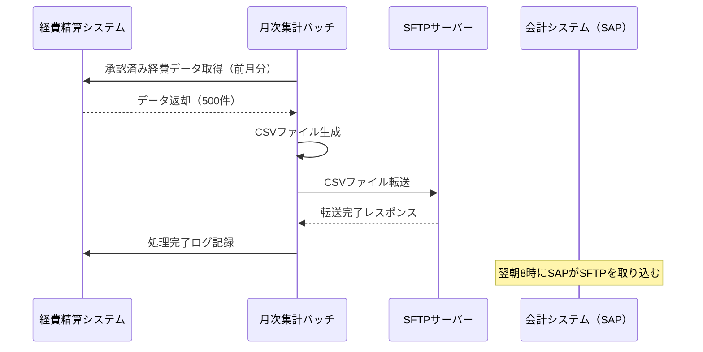

## D-10. 詳細外部インタフェース設計書

| 観点 | ツール | データ形式 |
|-----|-------|----------|
| 世界標準 | OpenAPI（REST API連携）、AsyncAPI（非同期・メッセージング連携）、Confluence | YAML、Markdown |
| 日本の現場 | Excel、Word | XLSX、DOCX |
| ◎ ベスト | **REST API連携 → OpenAPI（YAML）** / **ファイル・その他連携 → Excel** | **YAML or XLSX（連携方式による）** |

**ベストを選ぶ理由**
- 基本設計と同じ判断基準。詳細設計では項目レベルの仕様を加えて充実させる
- 特にファイル連携（CSV等）は項目定義を詳細化することが重要

**詳細設計フェーズで追加すべき内容**

| 追加項目 | 内容 |
|--------|------|
| 全項目の型・桁数・必須/任意 | 基本設計の項目一覧に型情報を追記 |
| コード値の定義 | 区分値の全パターンと意味 |
| 異常データの扱い | 不正データが来た場合のスキップ/エラー停止方針 |
| 文字コード・改行コード | UTF-8 / Shift_JIS、CR+LF / LF の指定 |
| ヘッダー行の有無 | CSVの場合は1行目の扱いを明示 |
| タイムゾーン | 日時データのタイムゾーン（JST / UTC）を明示 |

---

## D-11. 連携シーケンス図

| 観点 | ツール | データ形式 |
|-----|-------|----------|
| 世界標準 | **Mermaid**（sequenceDiagram）、**PlantUML**、Draw.io、Lucidchart | Markdown（Mermaid）、PNG、SVG |
| 日本の現場 | Excel、PowerPoint、Draw.io | XLSX、PPTX、PNG |
| ◎ ベスト | **Mermaid（テキスト管理）または PlantUML** | **MarkdownファイルとしてGit管理 ＋ PNG（設計書貼付用）** |

**ベストを選ぶ理由**
- Mermaid / PlantUMLはテキスト形式のため、Gitで変更履歴を追跡できる
- ConfluenceやNotionでネイティブレンダリングできるため、別途画像を貼り直す手間がない
- 複雑な図の場合はDraw.ioで描いてPNGエクスポートする方が見やすい場合もある

**Mermaidによるシーケンス図の記述例**

**PlantUMLとMermaidの使い分け**
| 観点 | Mermaid | PlantUML |
|-----|--------|--------|
| 記法のシンプルさ | ★★★ 簡単 | ★★☆ やや複雑 |
| 表現力 | ★★☆ | ★★★ 豊富 |
| Confluenceとの統合 | ネイティブ対応 | プラグイン必要 |
| ローカル生成 | Node.js必要 | Java必要 |

> **迷ったらMermaidを選んでください。** 記法がシンプルで、GitHubやConfluenceでそのまま表示できます。

---

## D-12. 詳細セキュリティ設計書

| 観点 | ツール | データ形式 |
|-----|-------|----------|
| 世界標準 | Confluence、Notion、**OWASP Threat Dragon**（脅威モデリング）、Draw.io（データフロー図） | Markdown、PNG |
| 日本の現場 | Word、Excel | DOCX、XLSX |
| ◎ ベスト | **Confluence または Notion（設計書本文）＋ OWASP Threat Dragon（脅威モデリング）** | **Markdown ＋ PNG** |

**ベストを選ぶ理由**
- OWASP Threat Dragonは無料OSSのツールで、データフロー図（DFD）を描きながら脅威を体系的に洗い出せる
- 詳細設計フェーズでは実装レベルの対策まで記述するため、箇条書きと表が混在するConfluenceが管理しやすい

**詳細設計フェーズで記述すべき内容（基本設計からの追加分）**

| セクション | 基本設計 | 詳細設計で追加する内容 |
|---------|--------|-----------------|
| 認証 | JWTを使う方針 | トークン生成ライブラリ・署名アルゴリズム（RS256等）・鍵管理方法・リフレッシュ実装方式 |
| パスワード | bcryptを使う方針 | ストレッチング回数（コスト係数）・保存フォーマット |
| 入力検証 | サーバーサイドで検証する方針 | バリデーションライブラリ名・実装パターン・全バリデーション項目一覧 |
| 監査ログ | 監査ログを取る方針 | ログのJSON構造・ログに含めるフィールド・ログに含めてはいけないフィールド |
| 通信暗号化 | HTTPS / TLS 1.2以上の方針 | 証明書の種類・更新手順・HSTSヘッダーの設定値 |

---

